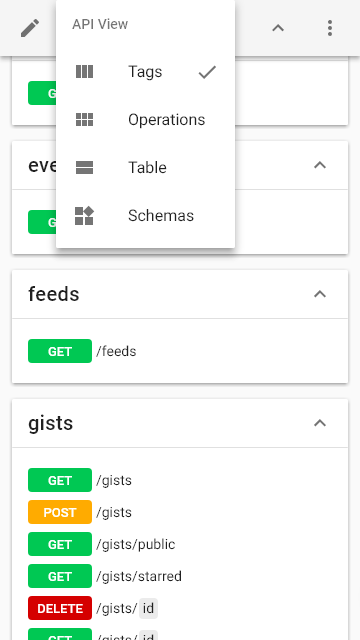
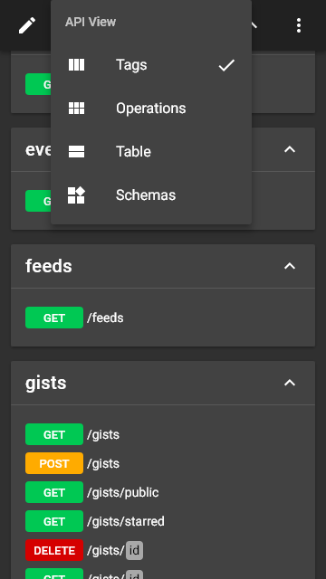
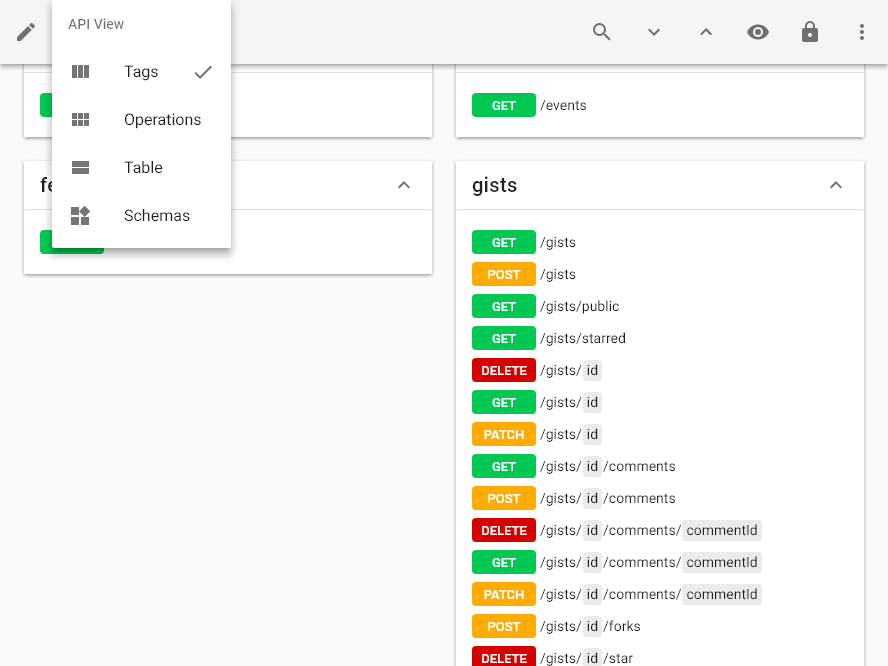
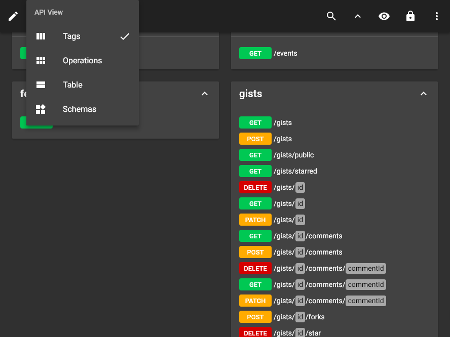

# layout <small>#9</small>

[Next](./10_view.md) &mdash; [1](./01_loading.md) [2](./02_landing.md) [3](./03_security.md) [4](./04_download.md) [5](./05_generator.md) [6](./06_language.md) [7](./07_options.md) [8](./08_menu.md) 9 [10](./10_view.md) [11](./11_wide.md) [12](./12_summary+paths.md) [13](./13_summary.md) [14](./14_operations.md) [15](./15_table.md) [16](./16_schemas.md) [17](./17_right.md) [18](./18_request.md) [19](./19_code.md) [20](./20_method.md) [21](./21_status.md) [22](./22_header.md) [23](./23_left.md) [24](./24_categories.md) [25](./25_recent.md) [26](./26_edit.md) [27](./27_fullscreen.md) [28](./28_test.md) [29](./29_methods.md) [30](./30_statuses.md) [31](./31_headers.md) [32](./32_about.md) [33](./33_markdown.md) [34](./34_syntax.md) 

[Next](./10_view.md) &mdash; [1](./01_loading.md) [2](./02_landing.md) [3](./03_security.md) [4](./04_download.md) [5](./05_generator.md) [6](./06_language.md) [7](./07_options.md) [8](./08_menu.md) 9 [10](./10_view.md) [11](./11_wide.md) [12](./12_summary+paths.md) [13](./13_summary.md) [14](./14_operations.md) [15](./15_table.md) [16](./16_schemas.md) [17](./17_right.md) [18](./18_request.md) [19](./19_code.md) [20](./20_method.md) [21](./21_status.md) [22](./22_header.md) [23](./23_left.md) [24](./24_categories.md) [25](./25_recent.md) [26](./26_edit.md) [27](./27_fullscreen.md) [28](./28_test.md) [29](./29_methods.md) [30](./30_statuses.md) [31](./31_headers.md) [32](./32_about.md) [33](./33_markdown.md) [34](./34_syntax.md) 
