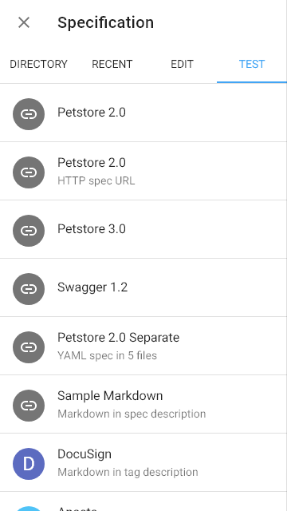
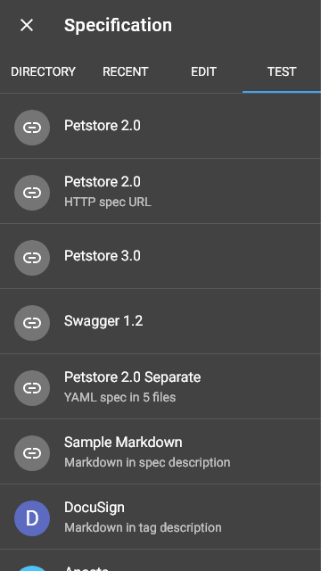
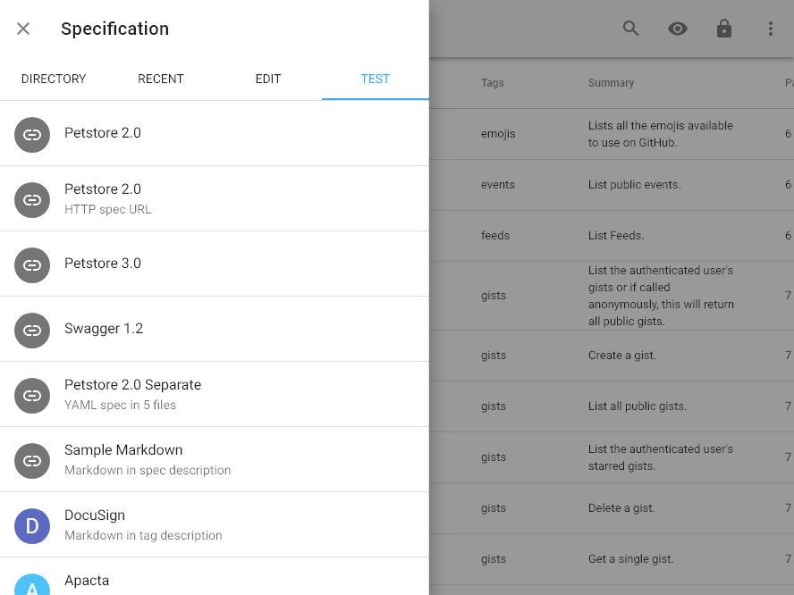
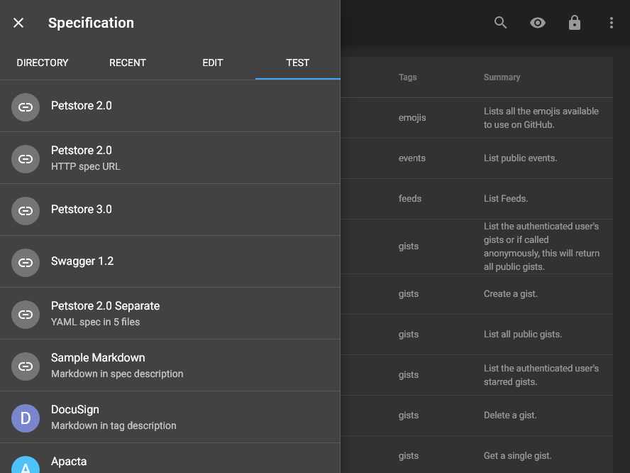

# test <small>#26</small>

[Next](./27_methods.md) &mdash; [1](./01_loading.md) [2](./02_landing.md) [3](./03_security.md) [4](./04_download.md) [5](./05_generator.md) [6](./06_language.md) [7](./07_options.md) [8](./08_menu.md) [9](./09_view.md) [10](./10_wide.md) [11](./11_summary+paths.md) [12](./12_summary.md) [13](./13_operations.md) [14](./14_table.md) [15](./15_right.md) [16](./16_request.md) [17](./17_code.md) [18](./18_method.md) [19](./19_status.md) [20](./20_header.md) [21](./21_left.md) [22](./22_categories.md) [23](./23_recent.md) [24](./24_edit.md) [25](./25_fullscreen.md) 26 [27](./27_methods.md) [28](./28_statuses.md) [29](./29_headers.md) [30](./30_about.md) [31](./31_markdown.md) [32](./32_syntax.md) 

[Next](./27_methods.md) &mdash; [1](./01_loading.md) [2](./02_landing.md) [3](./03_security.md) [4](./04_download.md) [5](./05_generator.md) [6](./06_language.md) [7](./07_options.md) [8](./08_menu.md) [9](./09_view.md) [10](./10_wide.md) [11](./11_summary+paths.md) [12](./12_summary.md) [13](./13_operations.md) [14](./14_table.md) [15](./15_right.md) [16](./16_request.md) [17](./17_code.md) [18](./18_method.md) [19](./19_status.md) [20](./20_header.md) [21](./21_left.md) [22](./22_categories.md) [23](./23_recent.md) [24](./24_edit.md) [25](./25_fullscreen.md) 26 [27](./27_methods.md) [28](./28_statuses.md) [29](./29_headers.md) [30](./30_about.md) [31](./31_markdown.md) [32](./32_syntax.md) 
