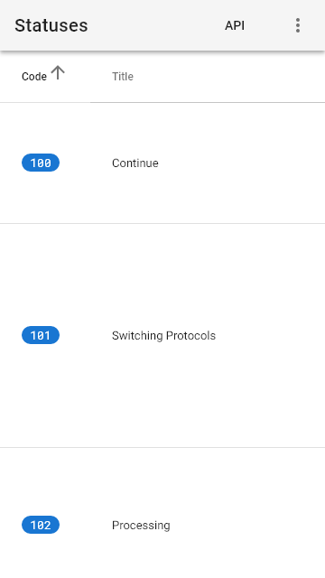
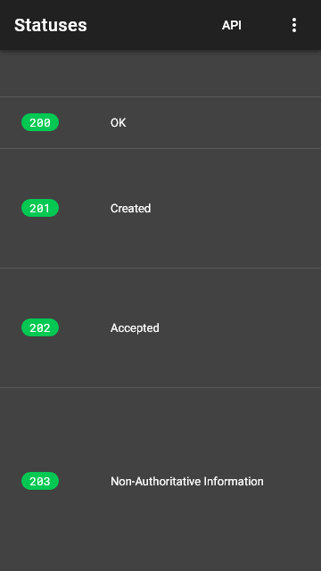
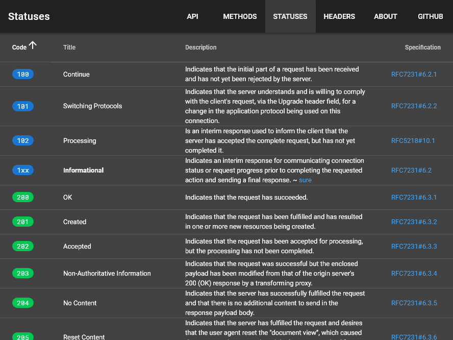

# statuses <small>#27</small>

[Next](./28_headers.md) &mdash; [1](./01_loading.md) [2](./02_landing.md) [3](./03_download.md) [4](./04_generator.md) [5](./05_language.md) [6](./06_options.md) [7](./07_menu.md) [8](./08_view.md) [9](./09_wide.md) [10](./10_summary+paths.md) [11](./11_summary.md) [12](./12_operations.md) [13](./13_table.md) [14](./14_right.md) [15](./15_request.md) [16](./16_code.md) [17](./17_method.md) [18](./18_status.md) [19](./19_header.md) [20](./20_left.md) [21](./21_categories.md) [22](./22_recent.md) [23](./23_edit.md) [24](./24_fullscreen.md) [25](./25_test.md) [26](./26_methods.md) 27 [28](./28_headers.md) [29](./29_about.md) 

[Next](./28_headers.md) &mdash; [1](./01_loading.md) [2](./02_landing.md) [3](./03_download.md) [4](./04_generator.md) [5](./05_language.md) [6](./06_options.md) [7](./07_menu.md) [8](./08_view.md) [9](./09_wide.md) [10](./10_summary+paths.md) [11](./11_summary.md) [12](./12_operations.md) [13](./13_table.md) [14](./14_right.md) [15](./15_request.md) [16](./16_code.md) [17](./17_method.md) [18](./18_status.md) [19](./19_header.md) [20](./20_left.md) [21](./21_categories.md) [22](./22_recent.md) [23](./23_edit.md) [24](./24_fullscreen.md) [25](./25_test.md) [26](./26_methods.md) 27 [28](./28_headers.md) [29](./29_about.md) 
