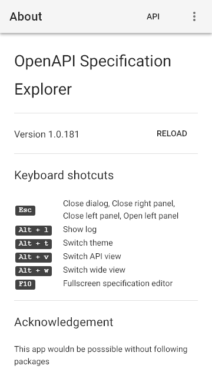
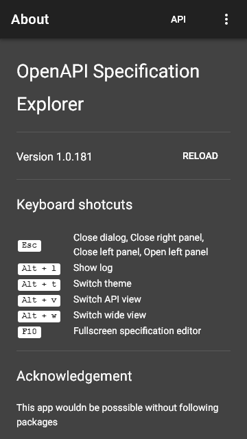
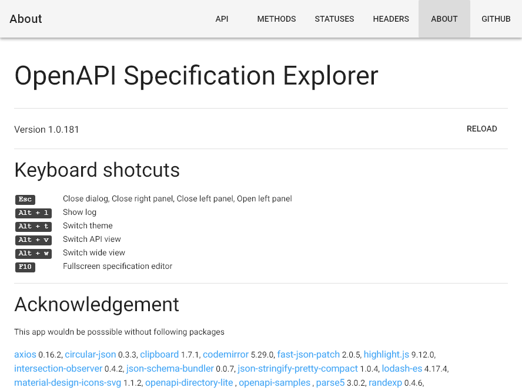
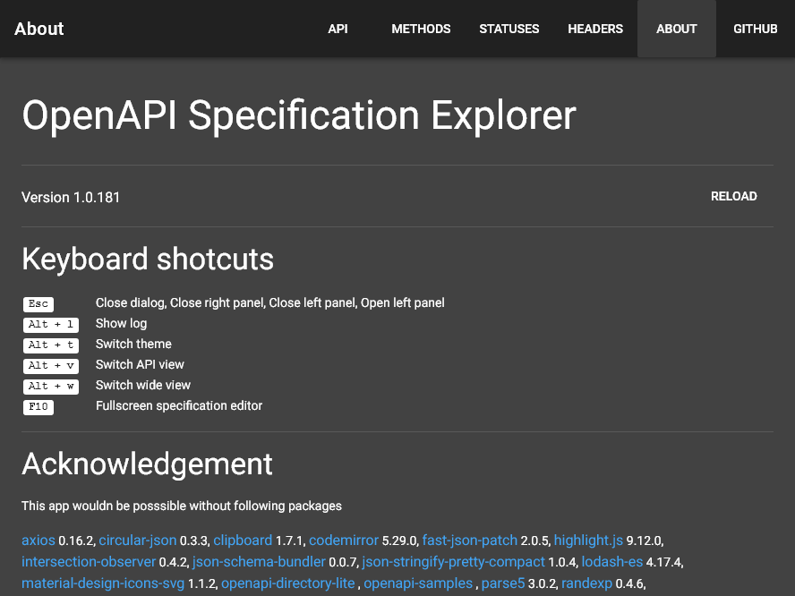

# about <small>#31</small>

[Next](./32_markdown.md) &mdash; [1](./01_loading.md) [2](./02_landing.md) [3](./03_security.md) [4](./04_download.md) [5](./05_generator.md) [6](./06_language.md) [7](./07_options.md) [8](./08_menu.md) [9](./09_view.md) [10](./10_wide.md) [11](./11_summary+paths.md) [12](./12_summary.md) [13](./13_operations.md) [14](./14_table.md) [15](./15_schemas.md) [16](./16_right.md) [17](./17_request.md) [18](./18_code.md) [19](./19_method.md) [20](./20_status.md) [21](./21_header.md) [22](./22_left.md) [23](./23_categories.md) [24](./24_recent.md) [25](./25_edit.md) [26](./26_fullscreen.md) [27](./27_test.md) [28](./28_methods.md) [29](./29_statuses.md) [30](./30_headers.md) 31 [32](./32_markdown.md) [33](./33_syntax.md) 

[Next](./32_markdown.md) &mdash; [1](./01_loading.md) [2](./02_landing.md) [3](./03_security.md) [4](./04_download.md) [5](./05_generator.md) [6](./06_language.md) [7](./07_options.md) [8](./08_menu.md) [9](./09_view.md) [10](./10_wide.md) [11](./11_summary+paths.md) [12](./12_summary.md) [13](./13_operations.md) [14](./14_table.md) [15](./15_schemas.md) [16](./16_right.md) [17](./17_request.md) [18](./18_code.md) [19](./19_method.md) [20](./20_status.md) [21](./21_header.md) [22](./22_left.md) [23](./23_categories.md) [24](./24_recent.md) [25](./25_edit.md) [26](./26_fullscreen.md) [27](./27_test.md) [28](./28_methods.md) [29](./29_statuses.md) [30](./30_headers.md) 31 [32](./32_markdown.md) [33](./33_syntax.md) 
