# md-dark <small>888&times;666</small>

## loading

## landing

## security

## download

## generator

## language

## options

## menu

## layout

## view

## wide

## summary+paths

[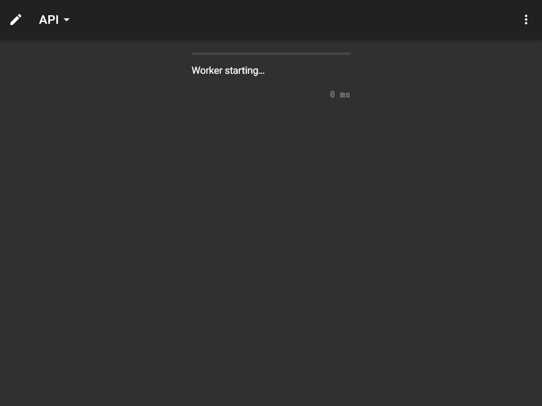](./images/dark_md_12_summary+paths.png)

## summary

[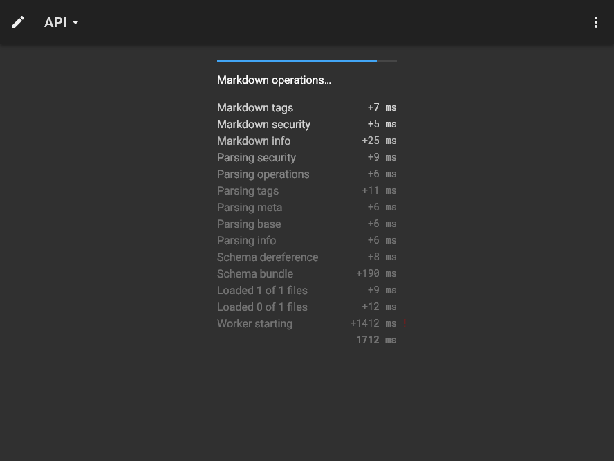](./images/dark_md_13_summary.png)

## operations

[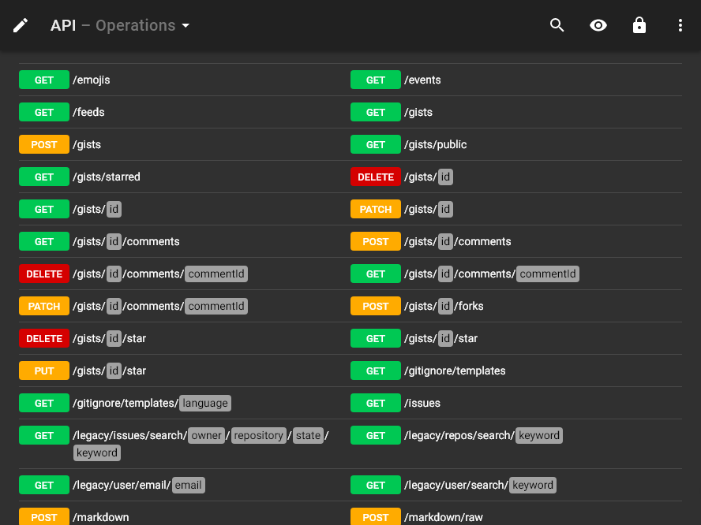](./images/dark_md_14_operations.png)

## table

[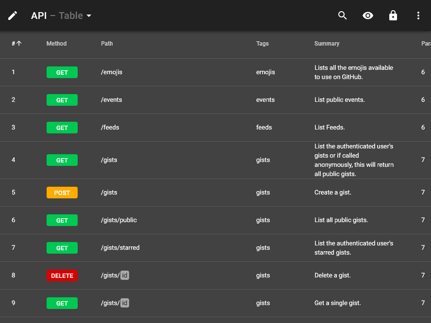](./images/dark_md_15_table.png)

## schemas

## right

[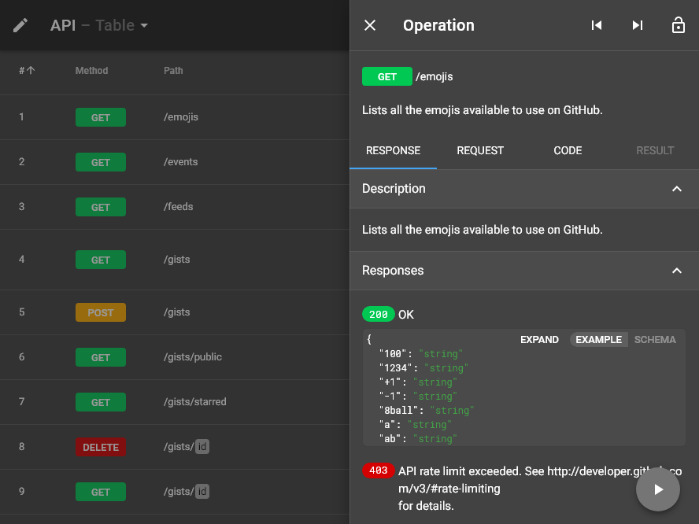](./images/dark_md_17_right.png)

## request

[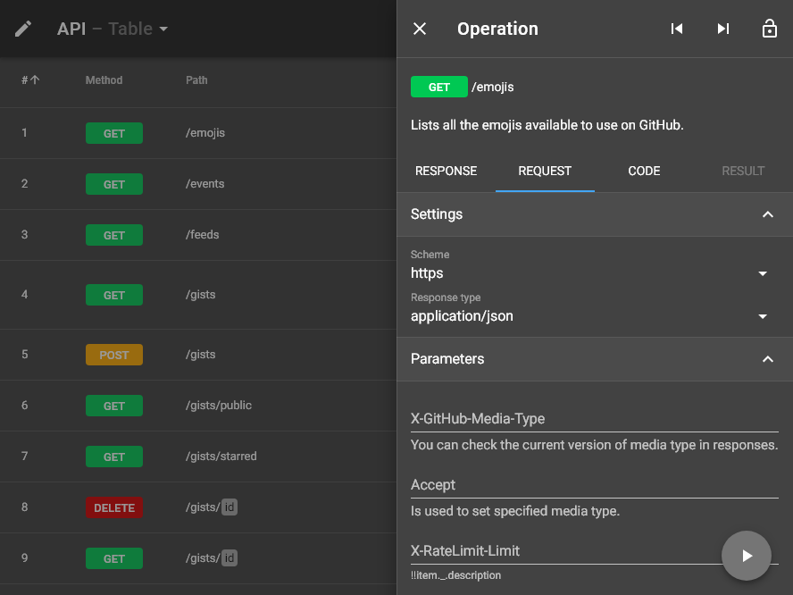](./images/dark_md_18_request.png)

## code

[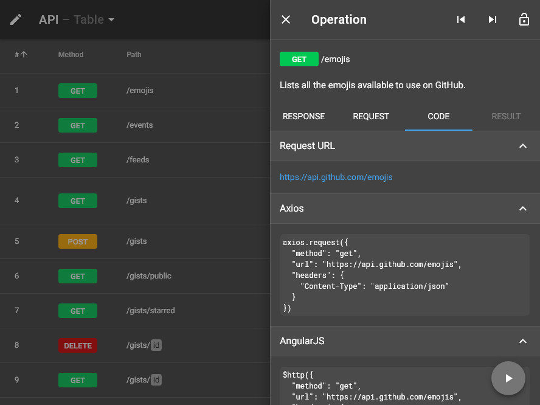](./images/dark_md_19_code.png)

## method

## status

[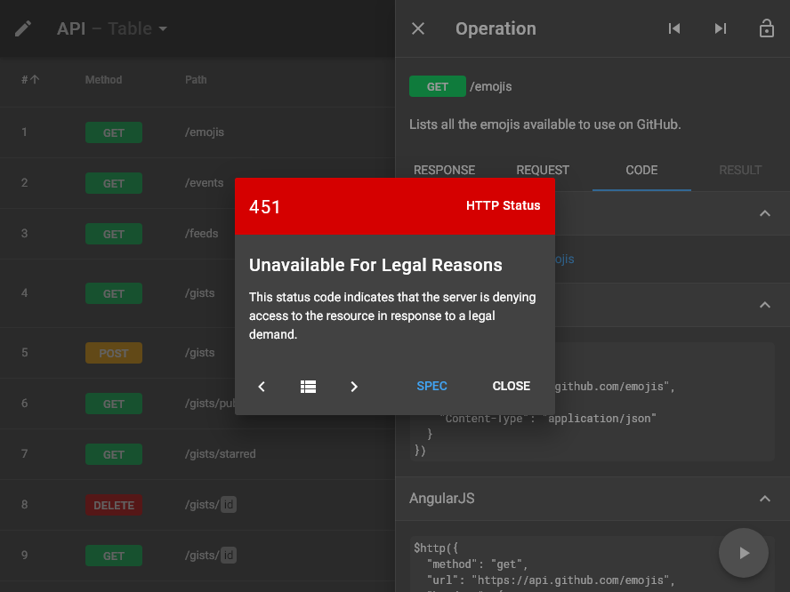](./images/dark_md_21_status.png)

## header

[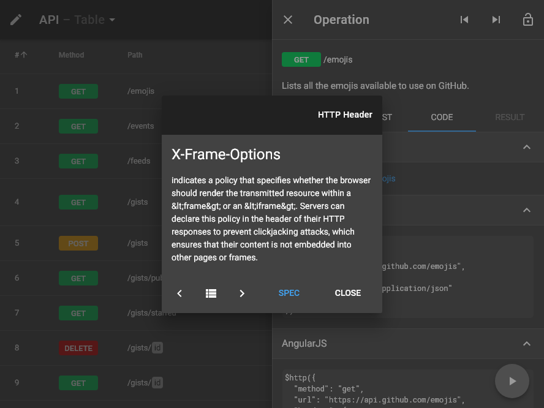](./images/dark_md_22_header.png)

## left

[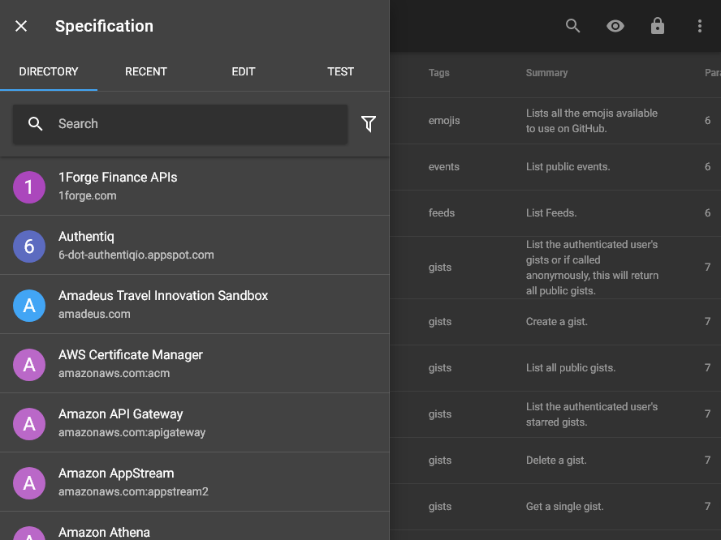](./images/dark_md_23_left.png)

## categories

## recent

## edit

## fullscreen

[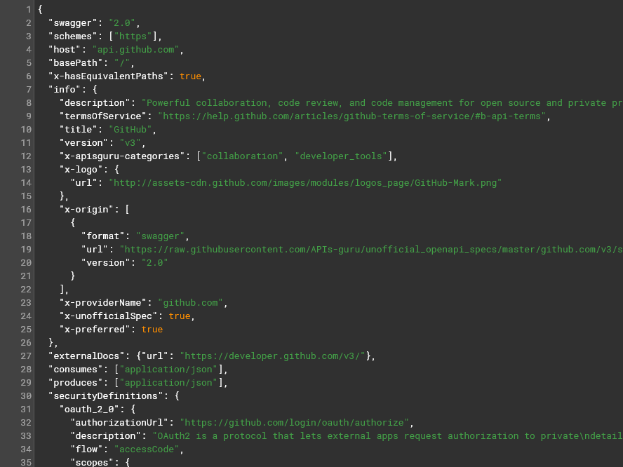](./images/dark_md_27_fullscreen.png)

## test

[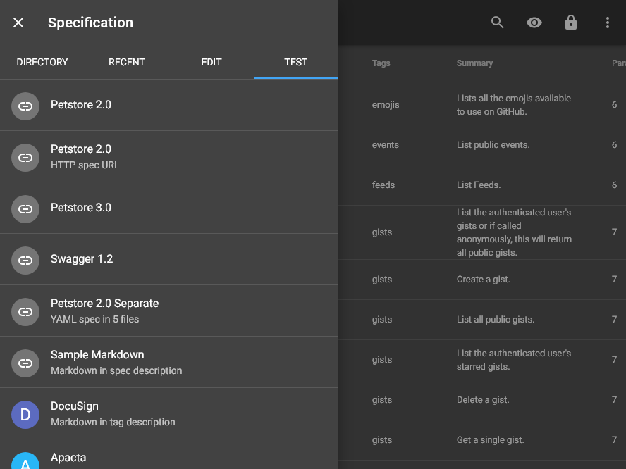](./images/dark_md_28_test.png)

## methods

[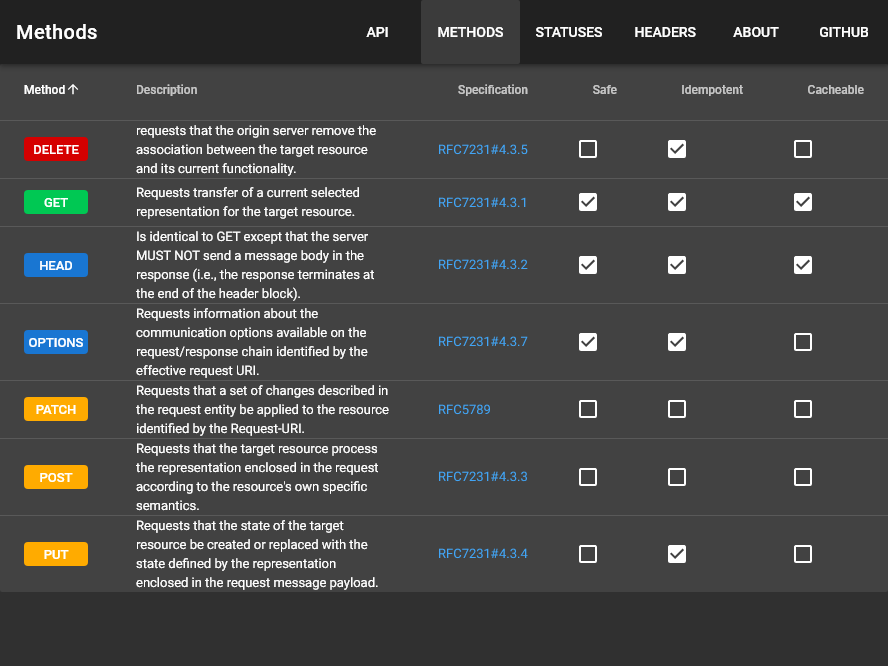](./images/dark_md_29_methods.png)

## statuses

[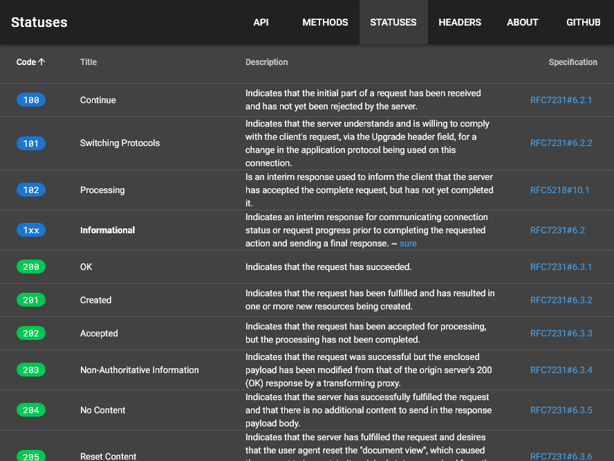](./images/dark_md_30_statuses.png)

## headers

## about

[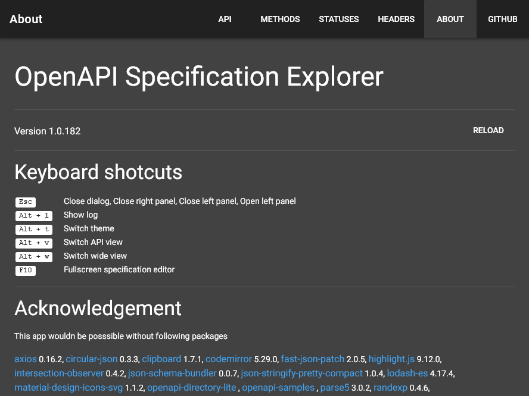](./images/dark_md_32_about.png)

## markdown

## syntax

[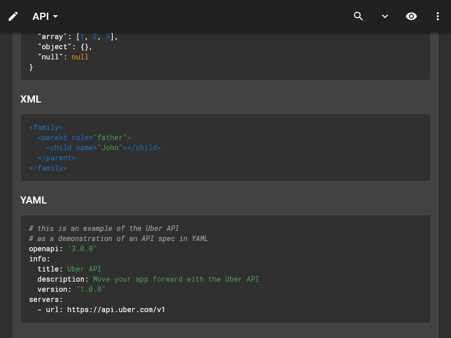](./images/dark_md_34_syntax.png)

