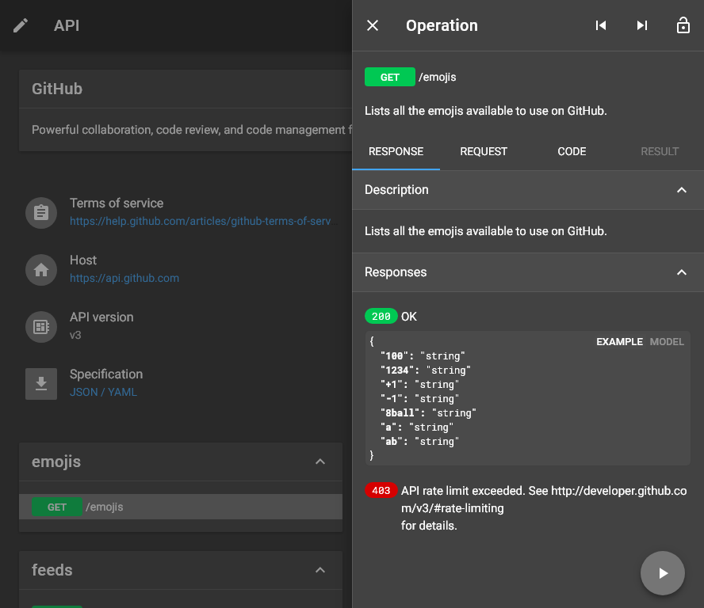
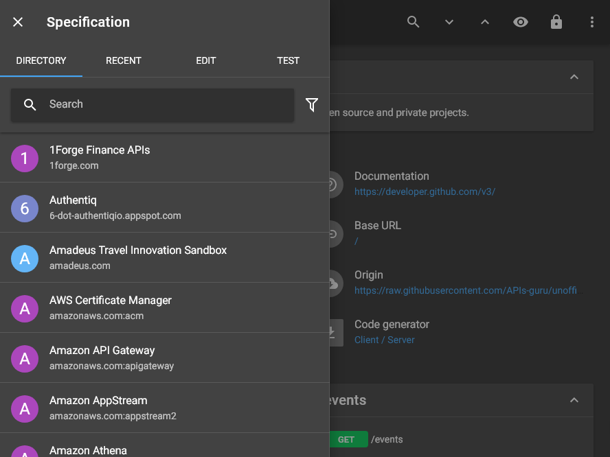
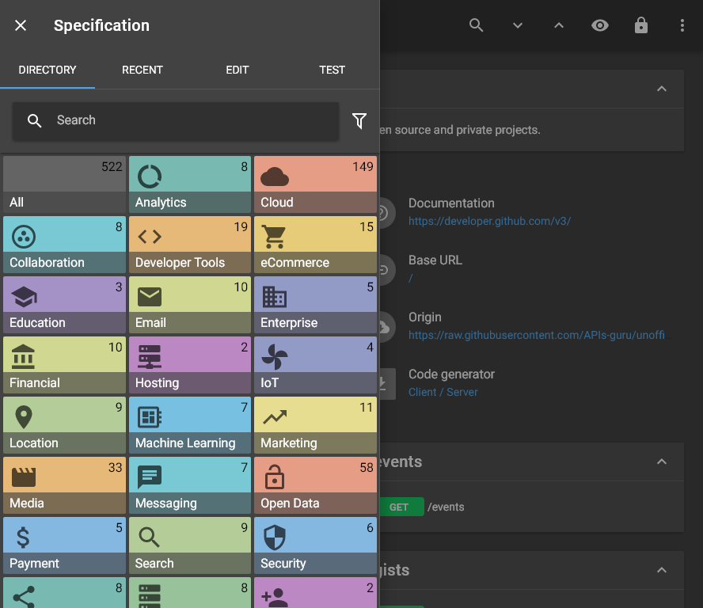
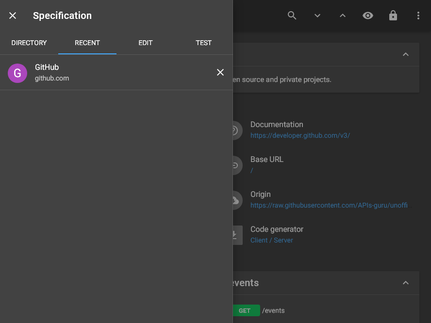
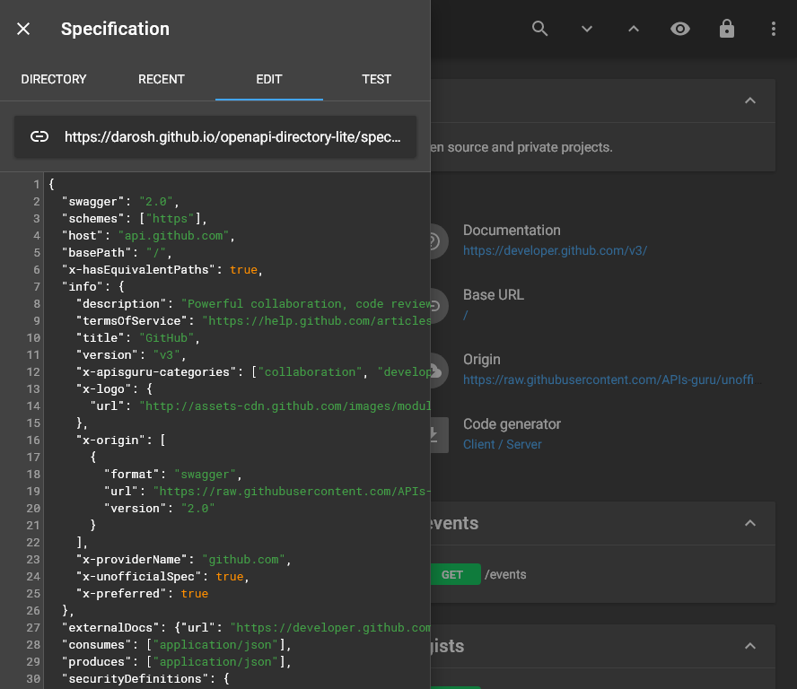
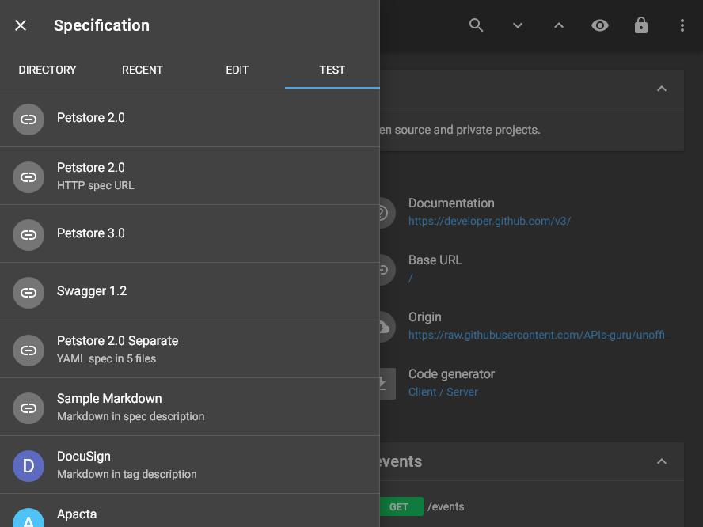
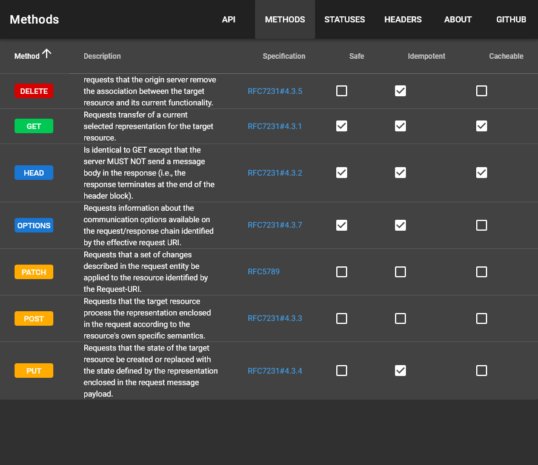
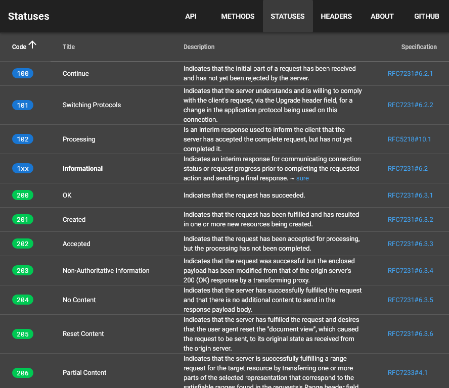
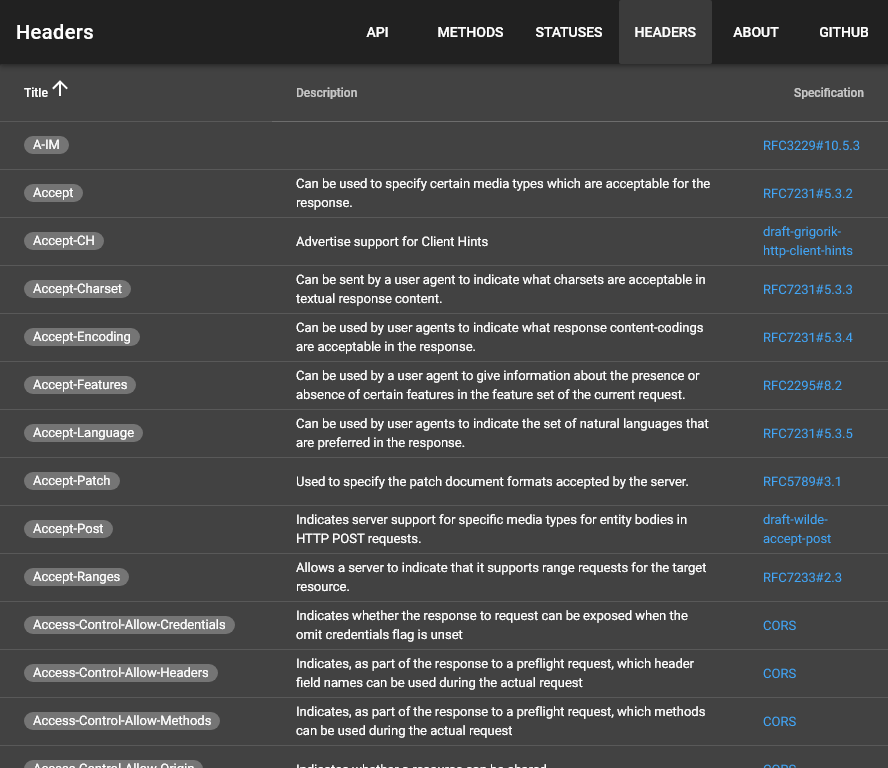

# Screenshots: md / dark <small>[888 &times; 768]</small>

## loading

## landing

## right

## left

## categories

## recent

## edit

## fullscreen

## test

## methods

## statuses

## headers

## about

