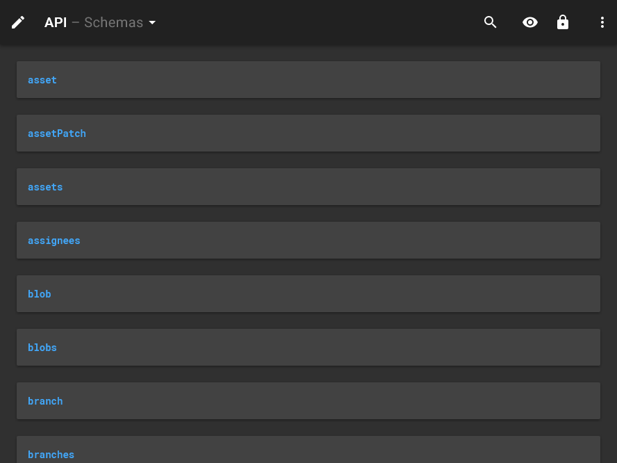
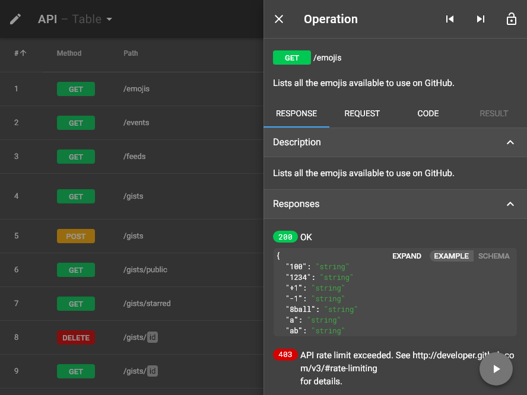
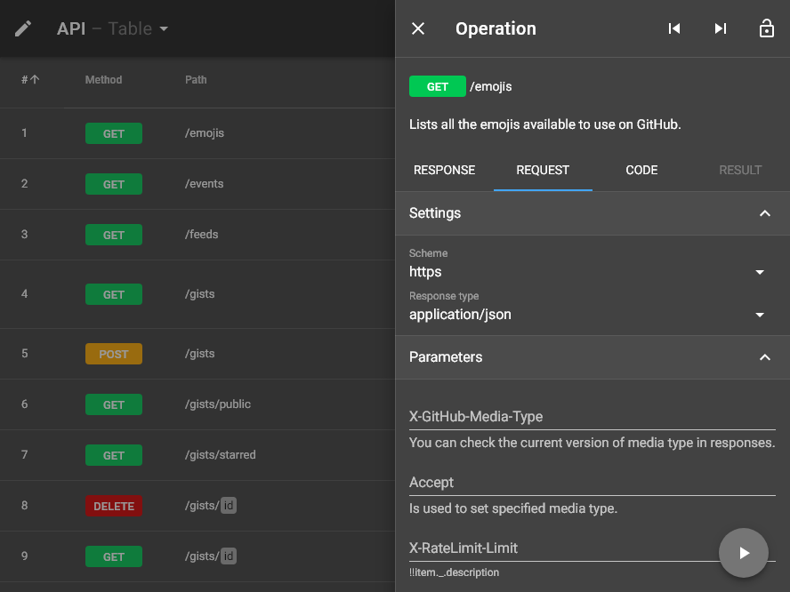
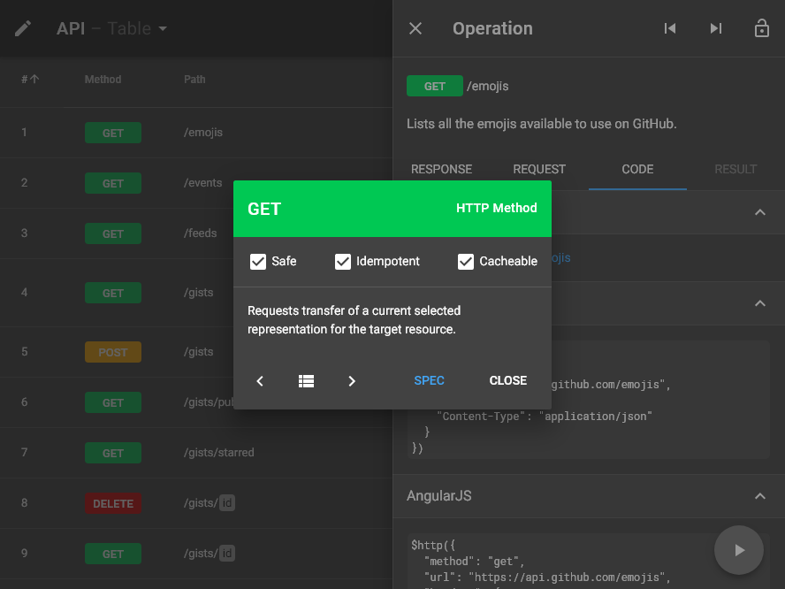
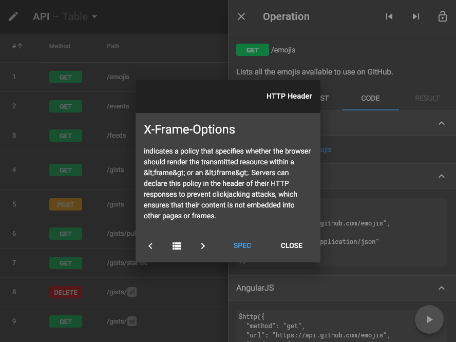
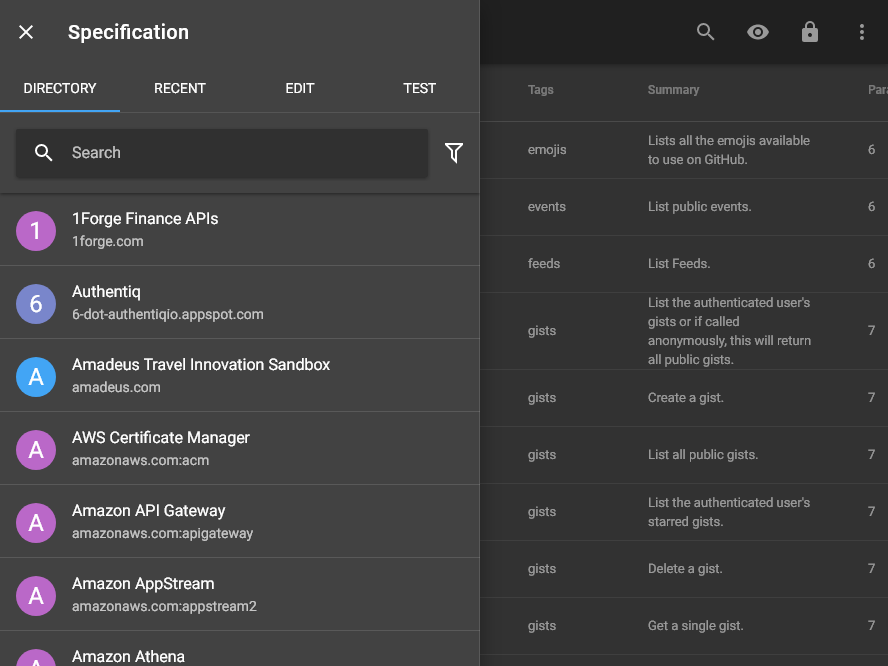
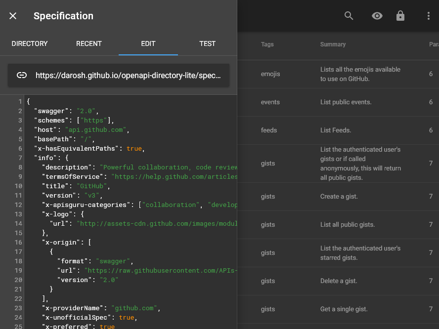
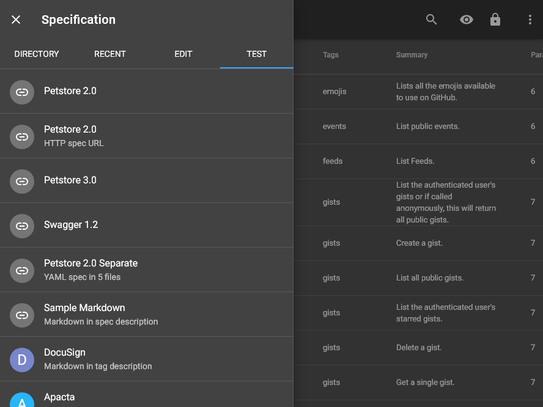
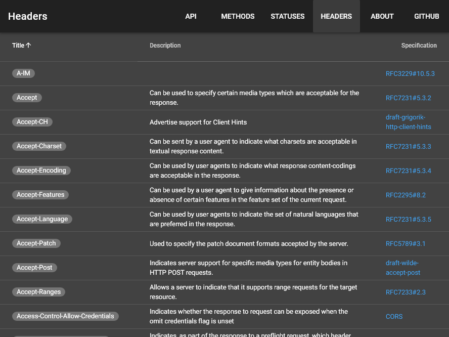
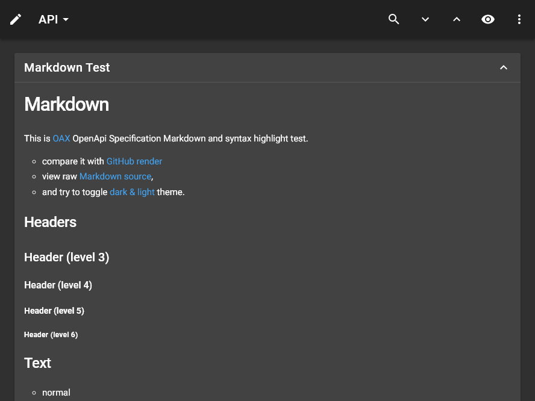

# md-dark <small>888&times;666</small>

## loading

## landing

## security

## download

## generator

## language

## options

## menu

## view

## wide

## summary+paths

## summary

## operations

## table

## schemas

## right

## request

## code

## method

## status

## header

## left

## categories

## recent

## edit

## fullscreen

## test

## methods

## statuses

## headers

## about

## markdown

## syntax

