# md-dark <small>888&times;666</small>

## loading

## landing

## download

## generator

## language

## options

[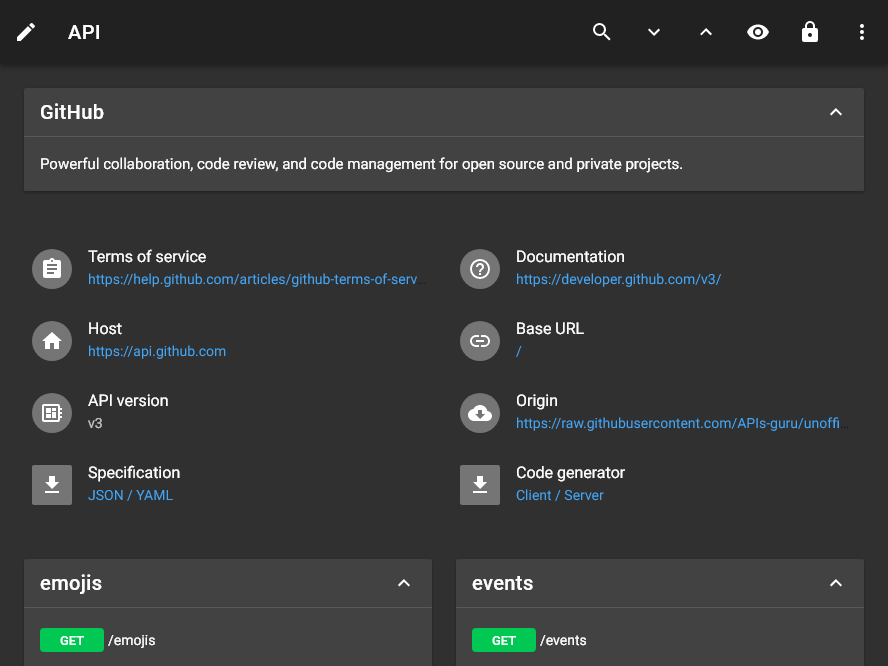](./images/dark_md_06_options.png)

## menu

[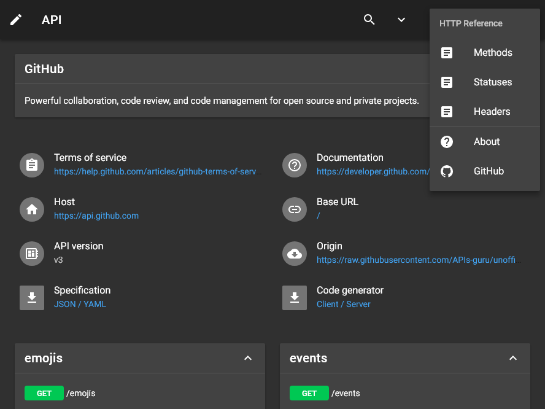](./images/dark_md_07_menu.png)

## view

## wide

[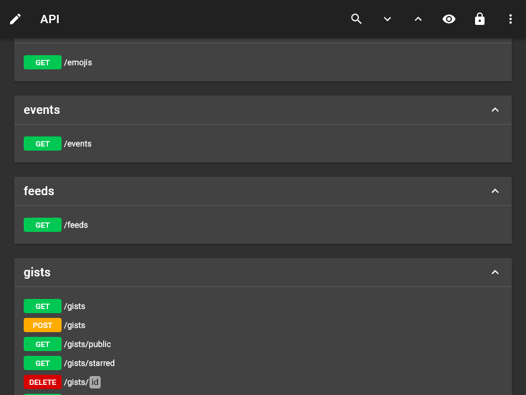](./images/dark_md_09_wide.png)

## summary+paths

[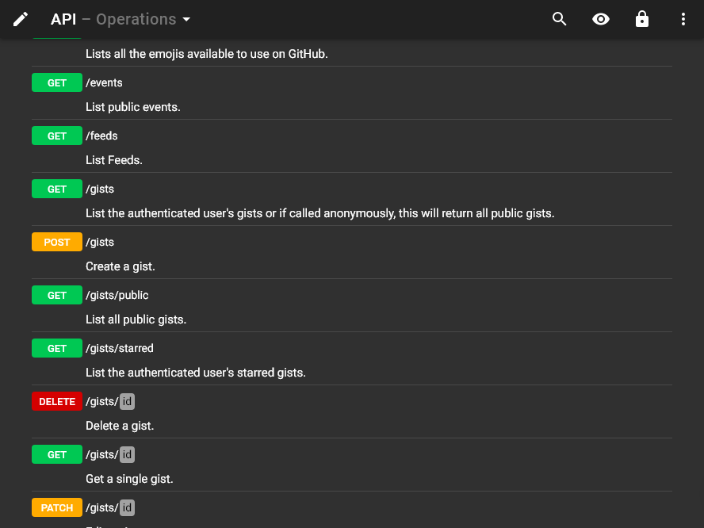](./images/dark_md_10_summary+paths.png)

## summary

## operations

## table

## right

[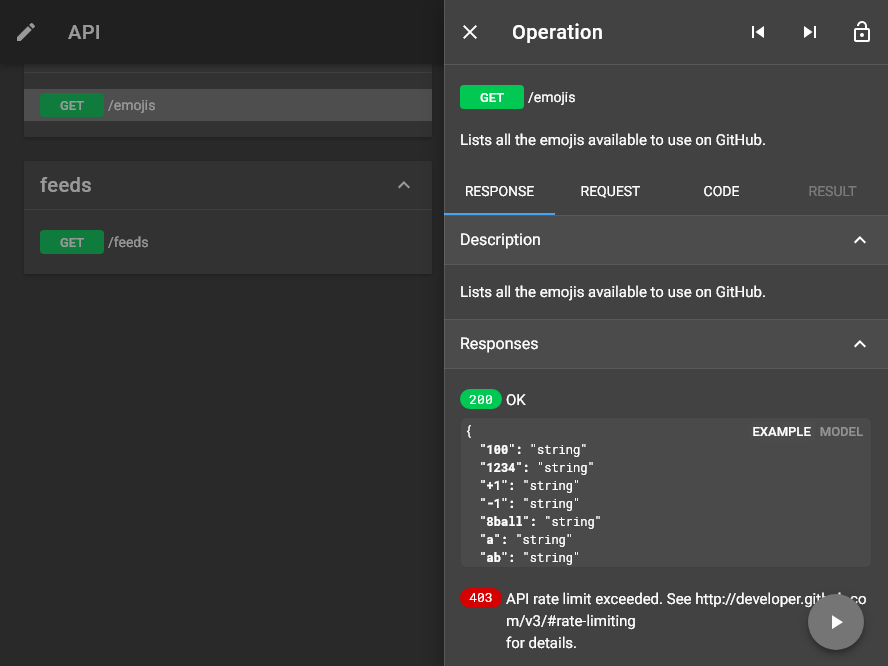](./images/dark_md_14_right.png)

## request

[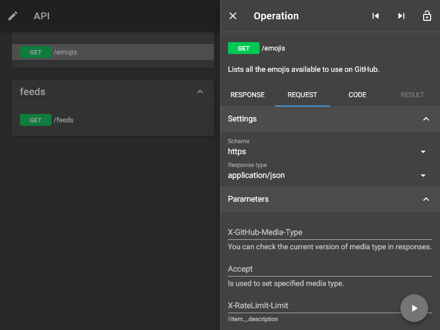](./images/dark_md_15_request.png)

## code

[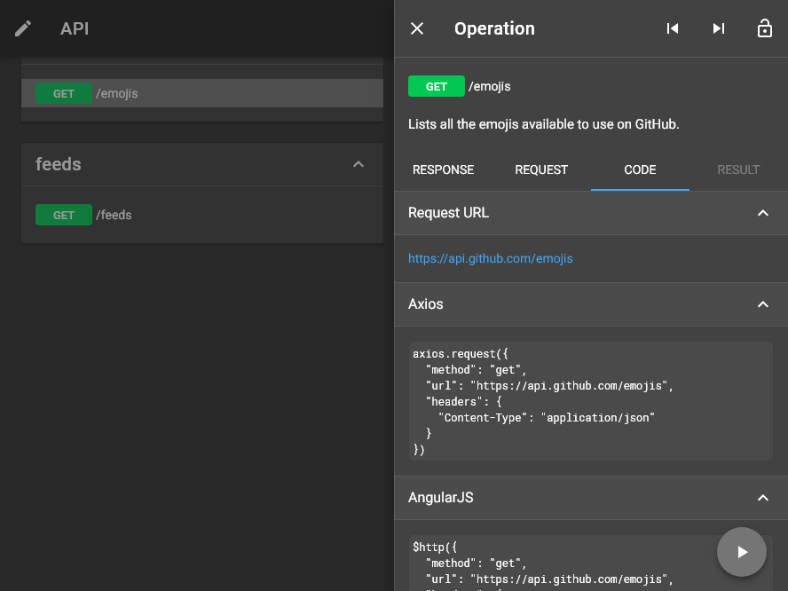](./images/dark_md_16_code.png)

## method

[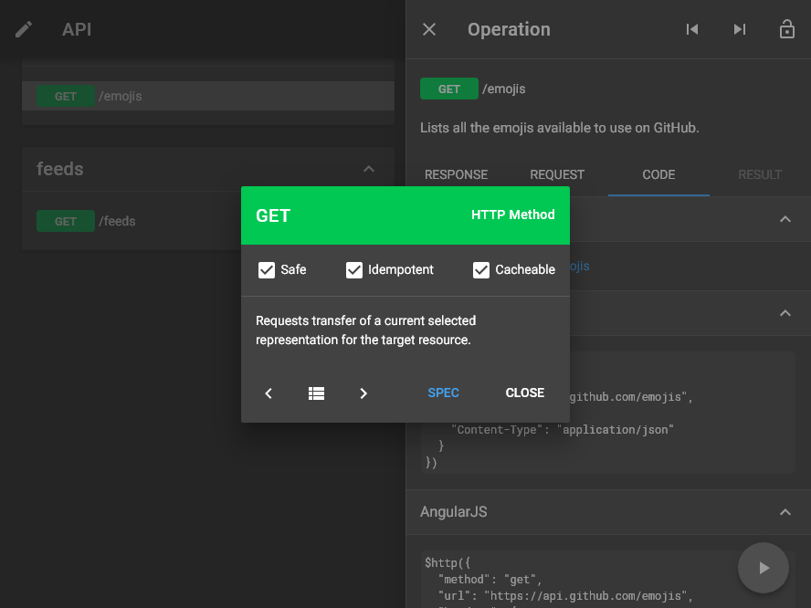](./images/dark_md_17_method.png)

## status

[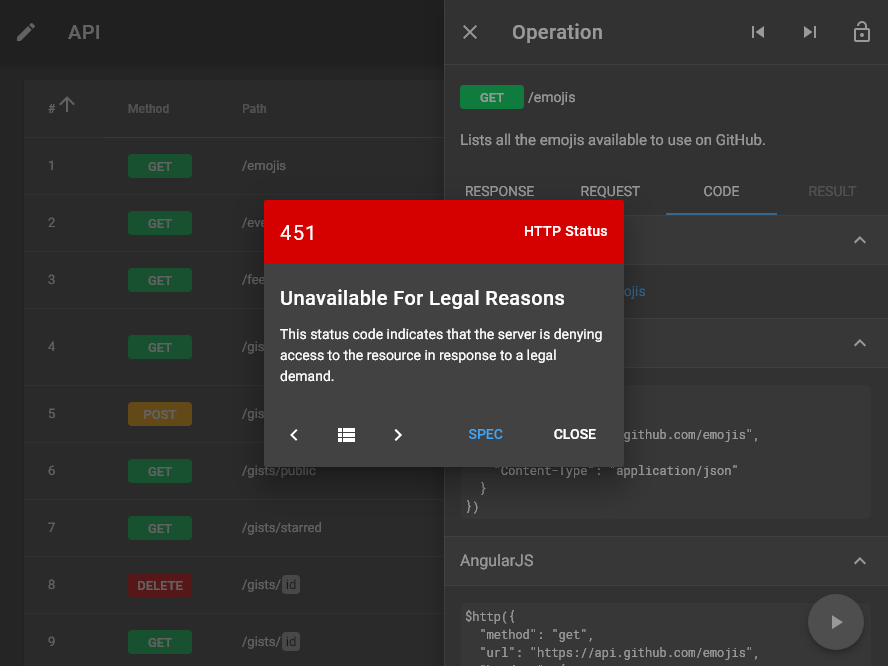](./images/dark_md_18_status.png)

## header

## left

## categories

## recent

[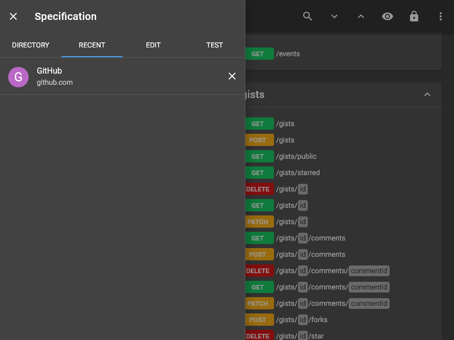](./images/dark_md_22_recent.png)

## edit

[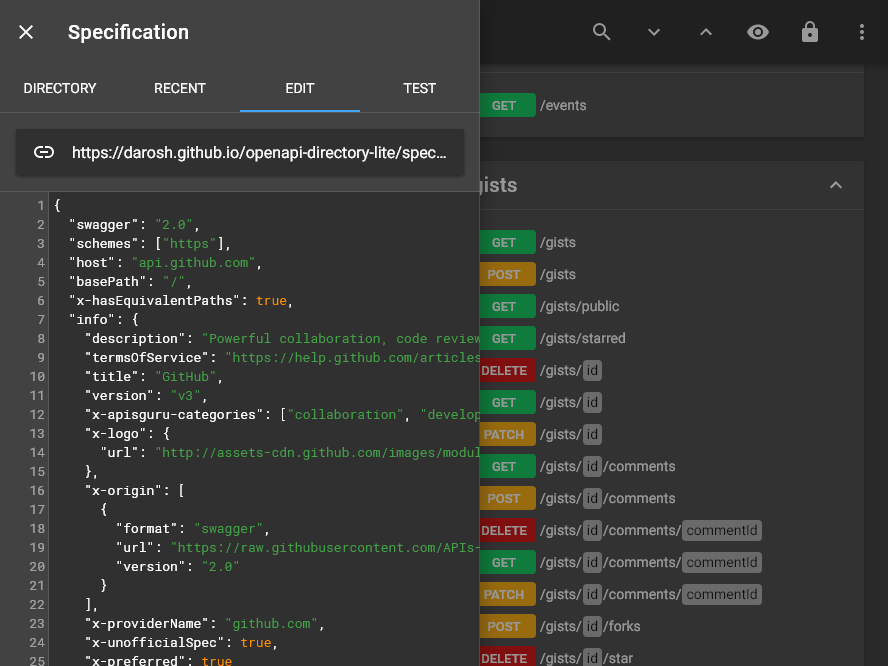](./images/dark_md_23_edit.png)

## fullscreen

## test

[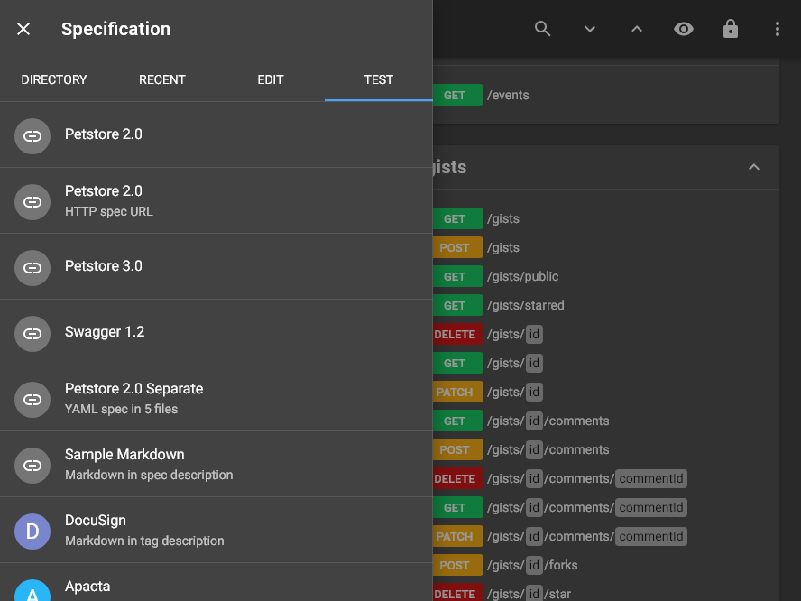](./images/dark_md_25_test.png)

## methods

## statuses

## headers

## about

[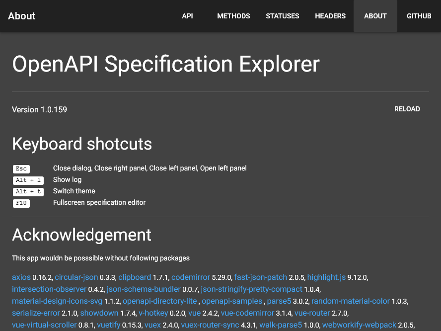](./images/dark_md_29_about.png)

