# Screenshots: xs-dark <small>360&times;640</small>

## loading

## landing

## download

## generator

## language

## options

## menu

[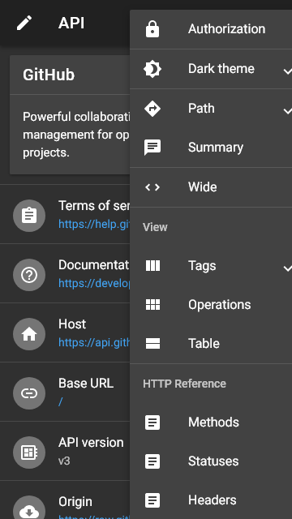](./images/dark_xs_07_menu.png)

## view

[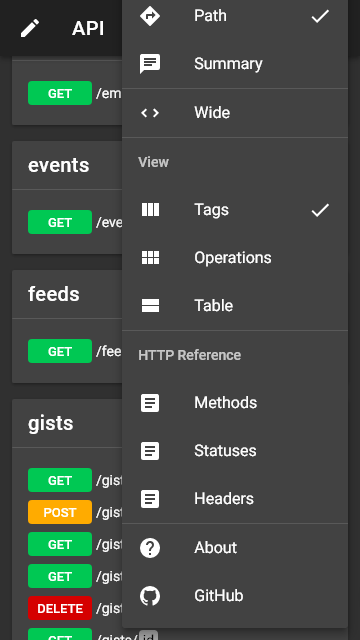](./images/dark_xs_08_view.png)

## wide

[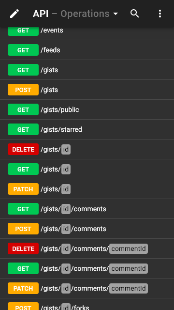](./images/dark_xs_09_wide.png)

## summary+paths

[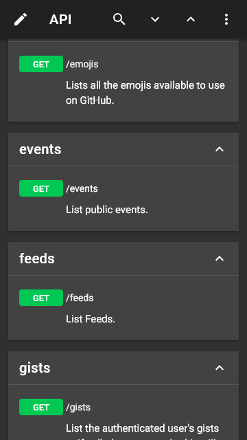](./images/dark_xs_10_summary+paths.png)

## summary

## operations

## table

[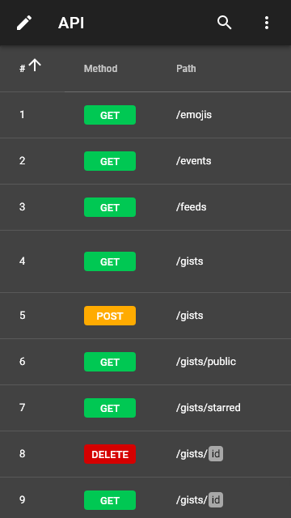](./images/dark_xs_13_table.png)

## right

[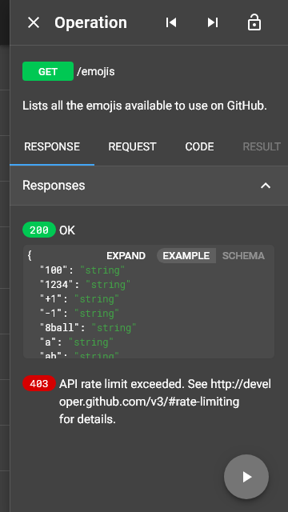](./images/dark_xs_14_right.png)

## request

## code

## method

[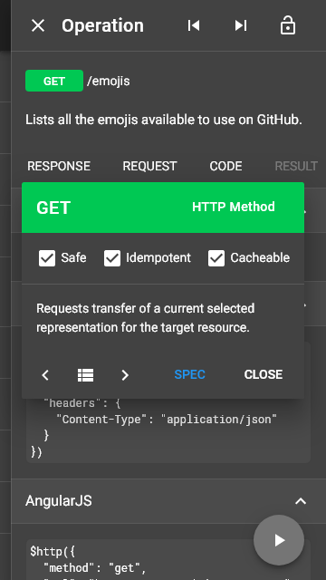](./images/dark_xs_17_method.png)

## status

[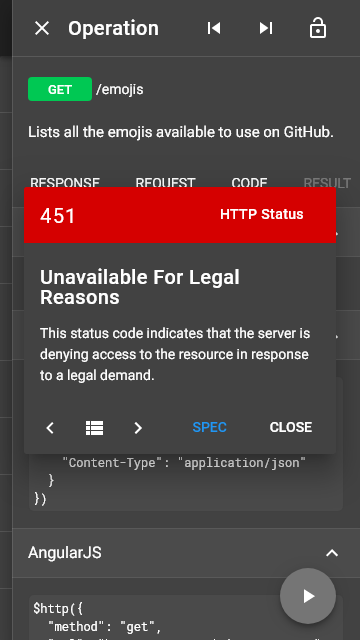](./images/dark_xs_18_status.png)

## header

[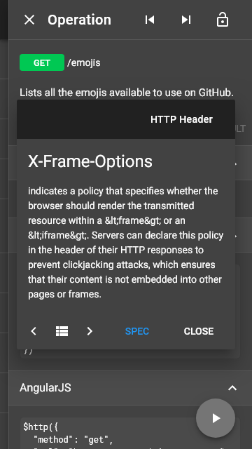](./images/dark_xs_19_header.png)

## left

## categories

[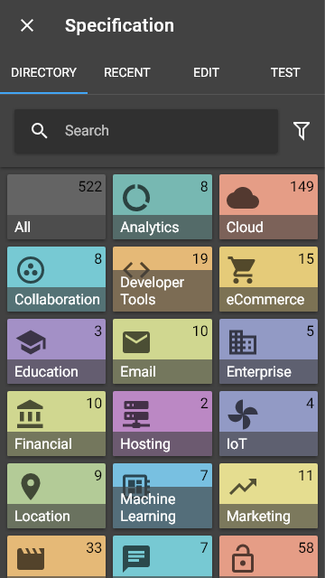](./images/dark_xs_21_categories.png)

## recent

[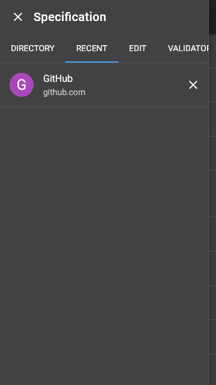](./images/dark_xs_22_recent.png)

## edit

[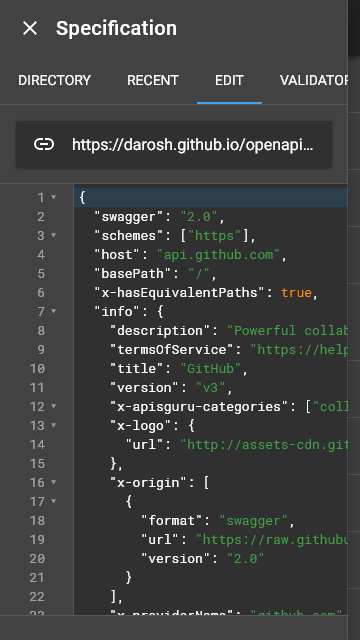](./images/dark_xs_23_edit.png)

## fullscreen

[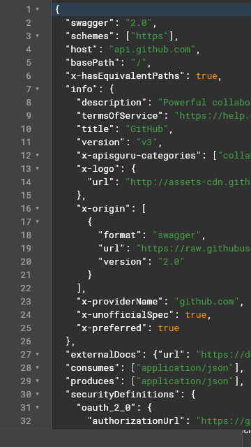](./images/dark_xs_24_fullscreen.png)

## test

[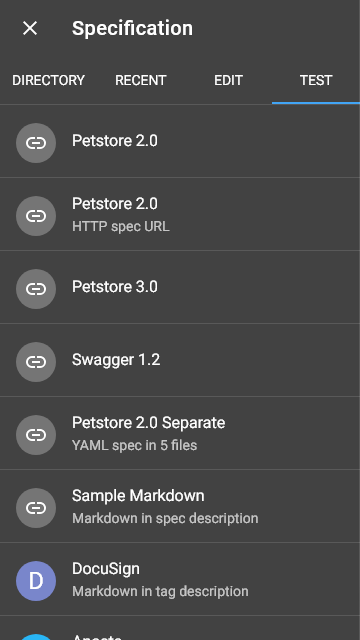](./images/dark_xs_25_test.png)

## methods

[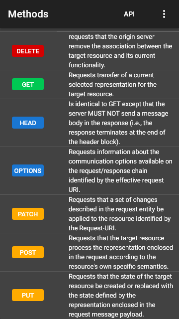](./images/dark_xs_26_methods.png)

## statuses

## headers

## about

[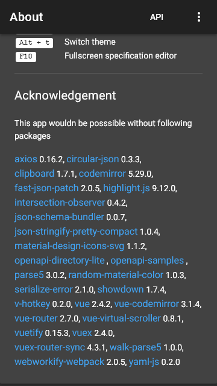](./images/dark_xs_29_about.png)

