# xs-dark <small>360&times;640</small>

## loading

## landing

## security

## download

## generator

## language

## options

## menu

## layout

## view

## wide

[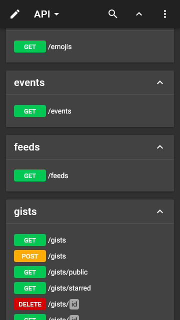](./images/dark_xs_11_wide.png)

## summary+paths

[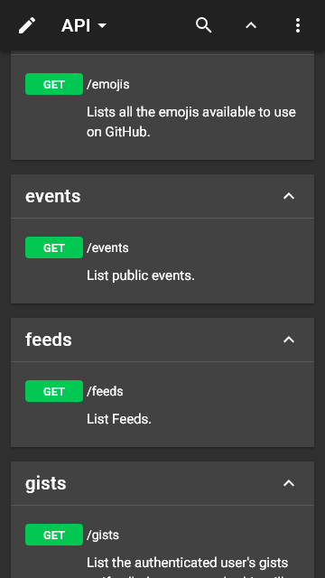](./images/dark_xs_12_summary+paths.png)

## summary

[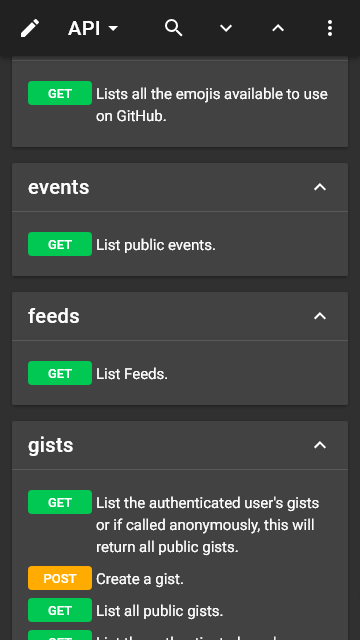](./images/dark_xs_13_summary.png)

## operations

[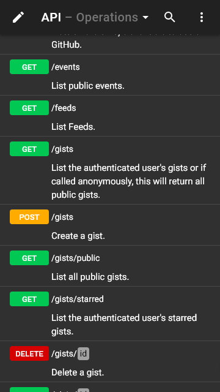](./images/dark_xs_14_operations.png)

## table

[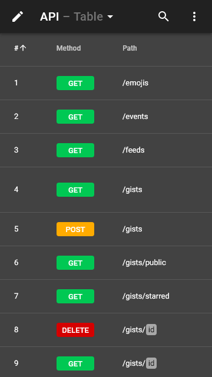](./images/dark_xs_15_table.png)

## schemas

[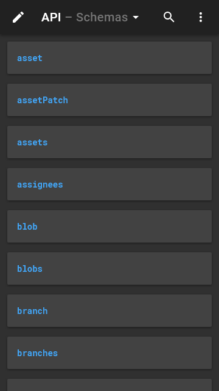](./images/dark_xs_16_schemas.png)

## right

## request

## code

## method

## status

[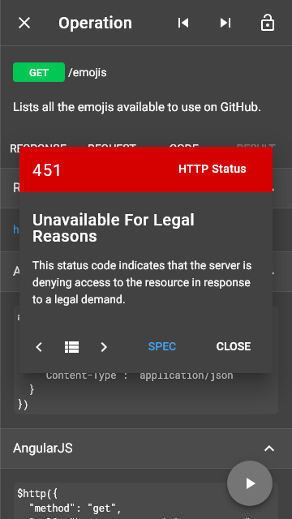](./images/dark_xs_21_status.png)

## header

## left

## categories

## recent

## edit

[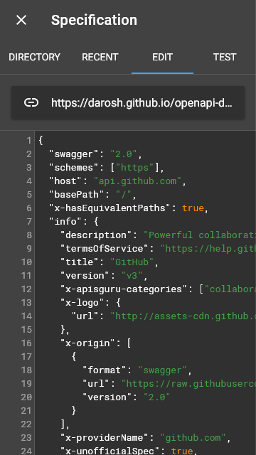](./images/dark_xs_26_edit.png)

## fullscreen

## test

## methods

[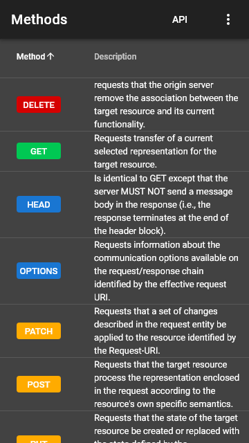](./images/dark_xs_29_methods.png)

## statuses

[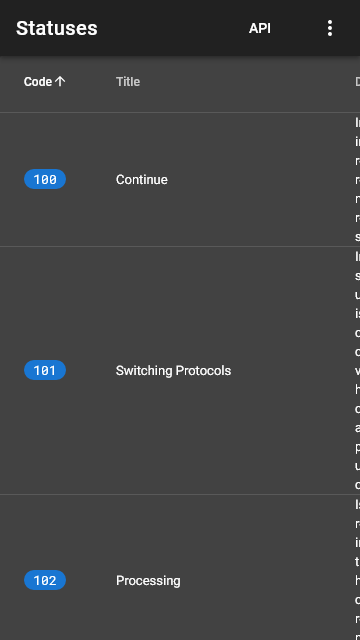](./images/dark_xs_30_statuses.png)

## headers

[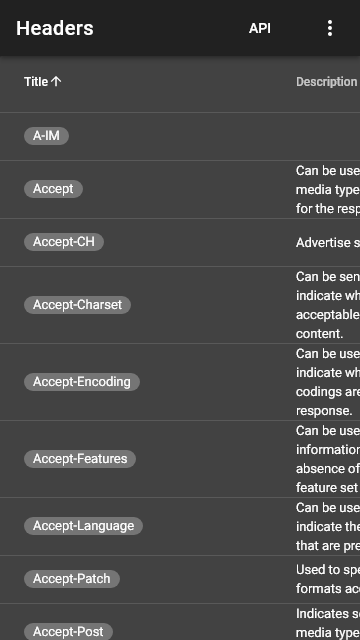](./images/dark_xs_31_headers.png)

## about

[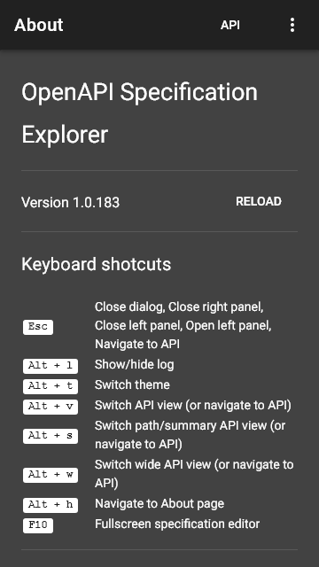](./images/dark_xs_32_about.png)

## markdown

[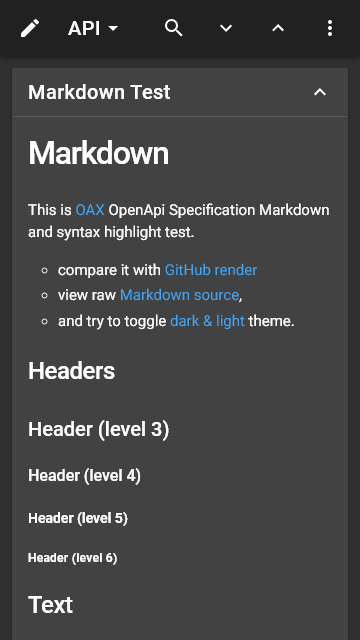](./images/dark_xs_33_markdown.png)

## syntax

[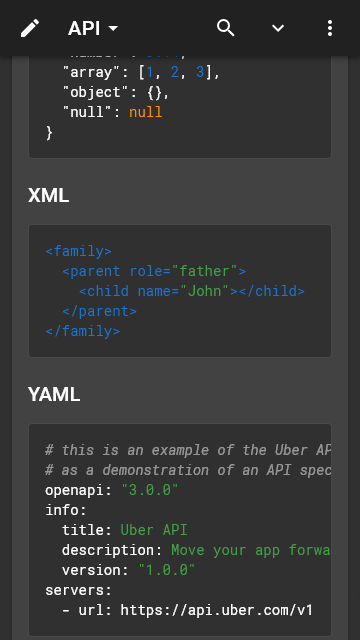](./images/dark_xs_34_syntax.png)

