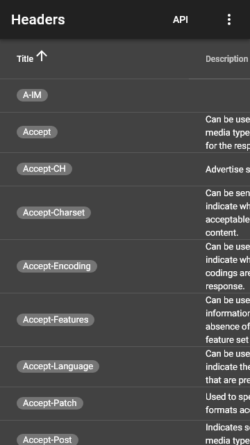

# Screenshots: xs / dark <small>[360 &times; 640]</small>

## loading

## landing

## right

## left

## categories

## recent

## edit

## fullscreen

## test

## methods

## statuses

## headers

## about

