# xs-dark <small>360&times;640</small>

## loading

## landing

## security

## download

[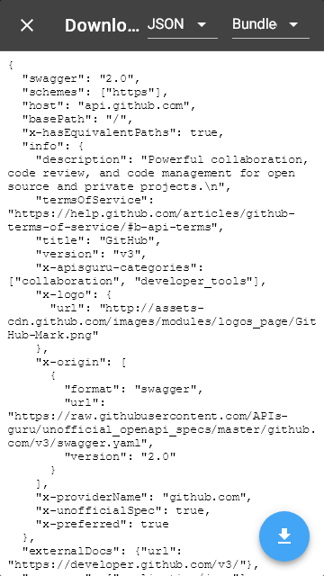](./images/dark_xs_04_download.png)

## generator

[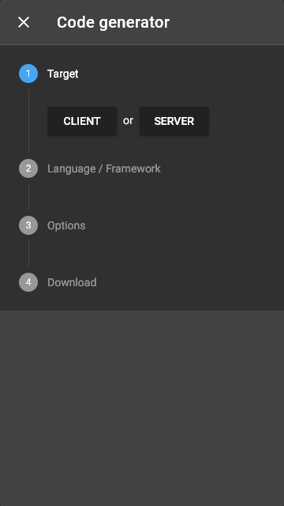](./images/dark_xs_05_generator.png)

## language

[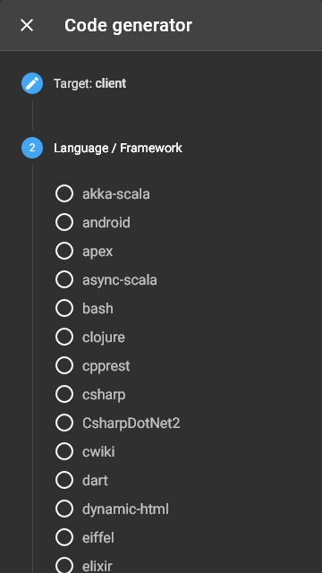](./images/dark_xs_06_language.png)

## options

[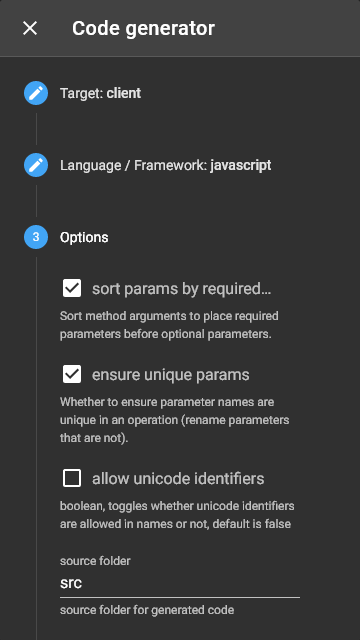](./images/dark_xs_07_options.png)

## menu

[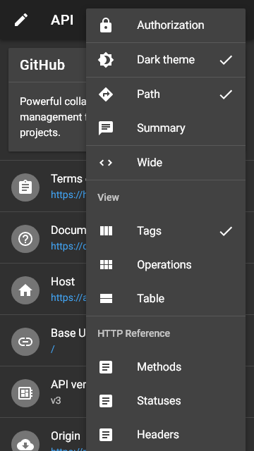](./images/dark_xs_08_menu.png)

## view

[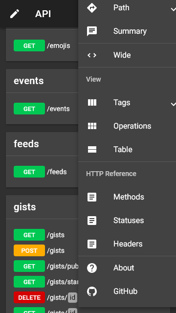](./images/dark_xs_09_view.png)

## wide

[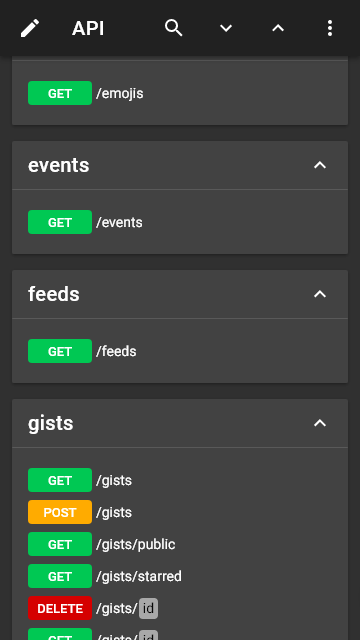](./images/dark_xs_10_wide.png)

## summary+paths

## summary

[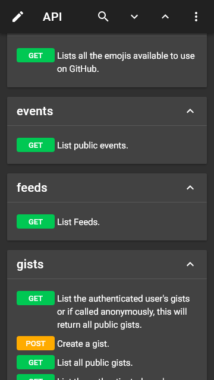](./images/dark_xs_12_summary.png)

## operations

[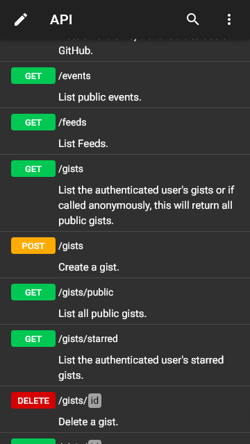](./images/dark_xs_13_operations.png)

## table

[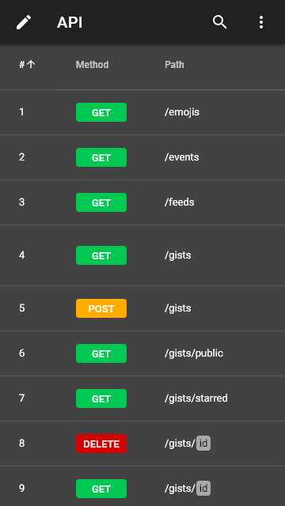](./images/dark_xs_14_table.png)

## right

[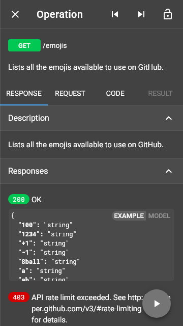](./images/dark_xs_15_right.png)

## request

## code

[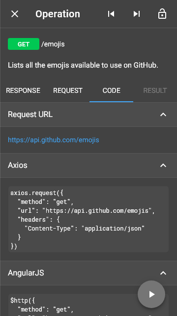](./images/dark_xs_17_code.png)

## method

[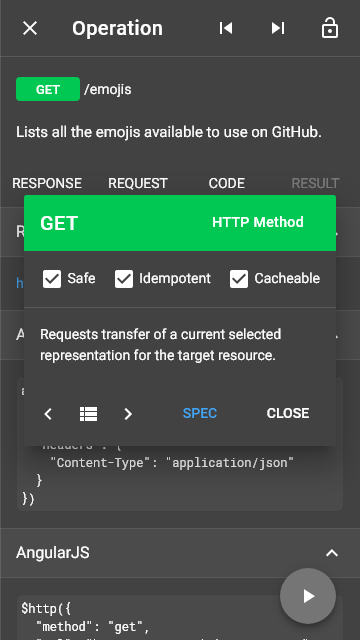](./images/dark_xs_18_method.png)

## status

## header

## left

## categories

## recent

## edit

## fullscreen

[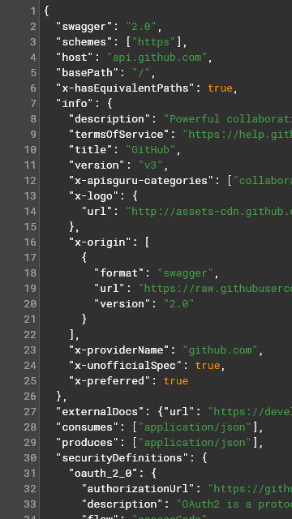](./images/dark_xs_25_fullscreen.png)

## test

## methods

[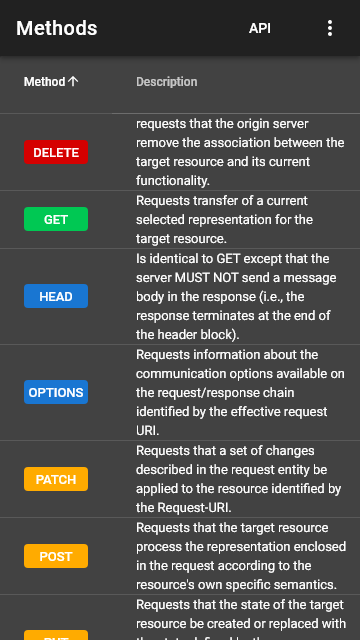](./images/dark_xs_27_methods.png)

## statuses

[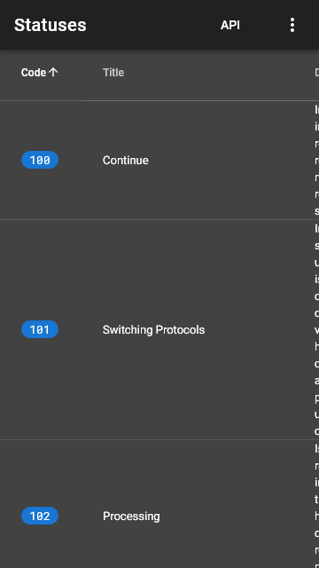](./images/dark_xs_28_statuses.png)

## headers

## about

[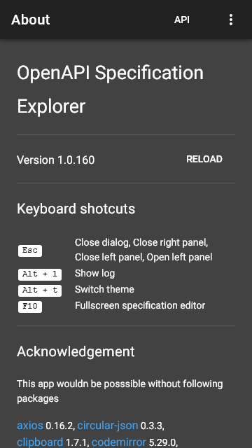](./images/dark_xs_30_about.png)

## markdown

## syntax

[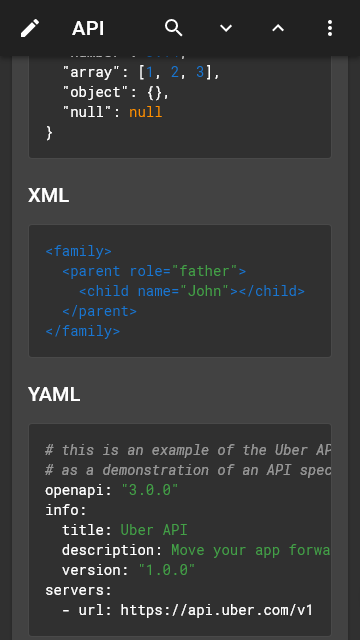](./images/dark_xs_32_syntax.png)

