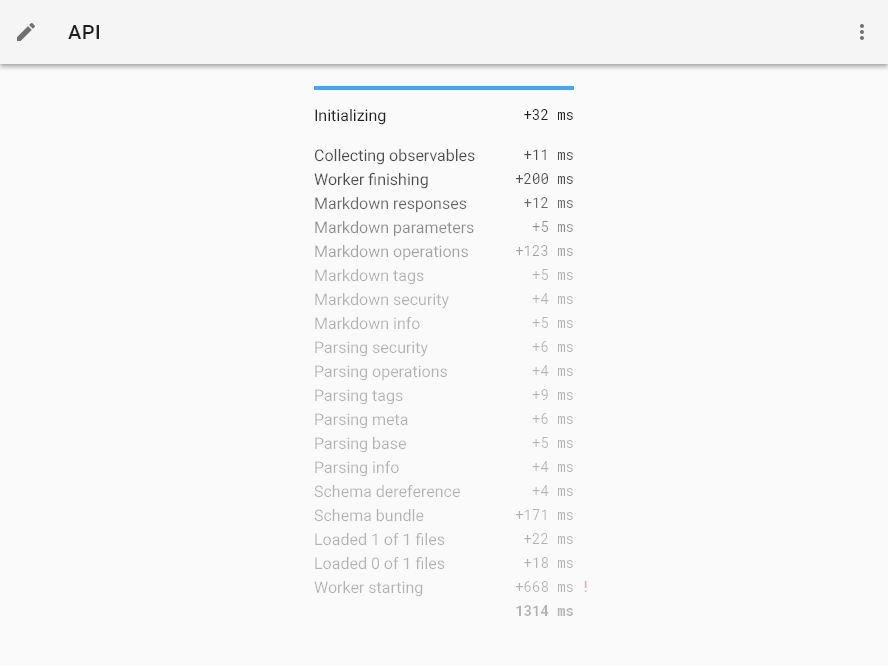
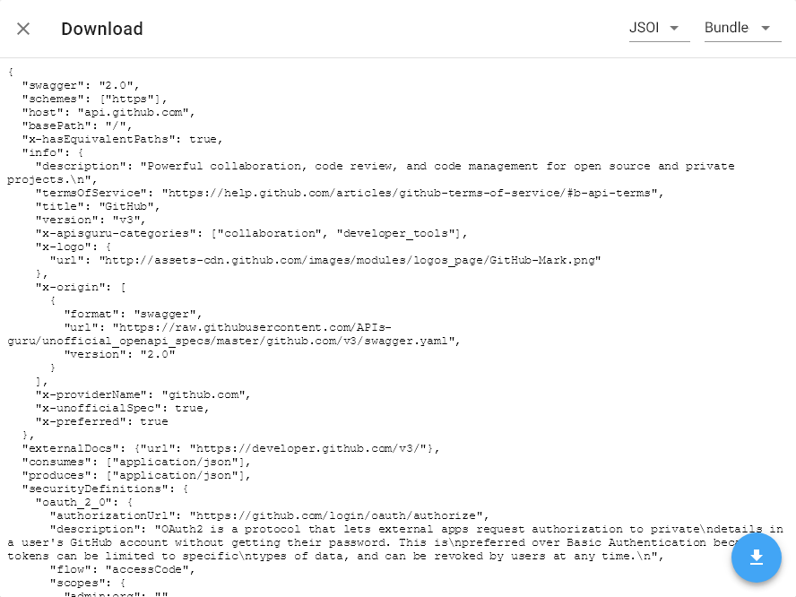
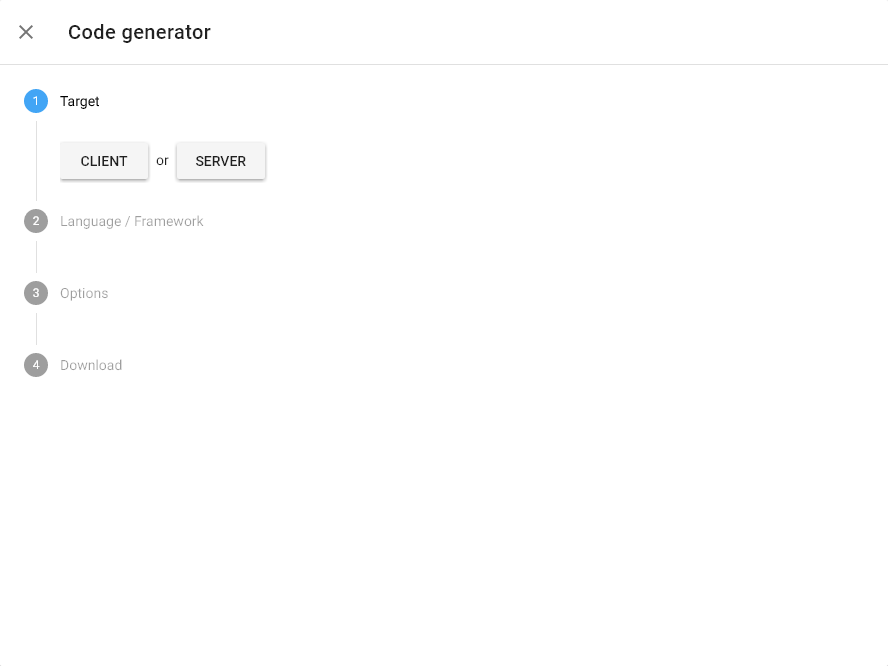
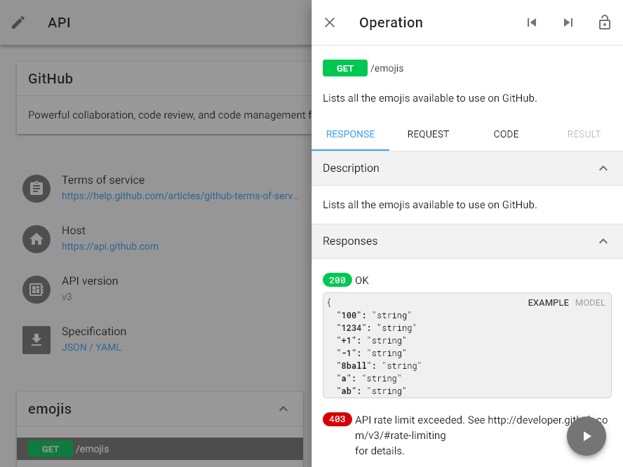
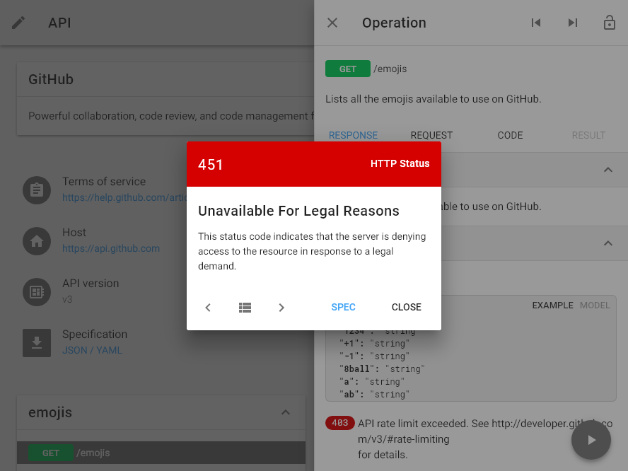
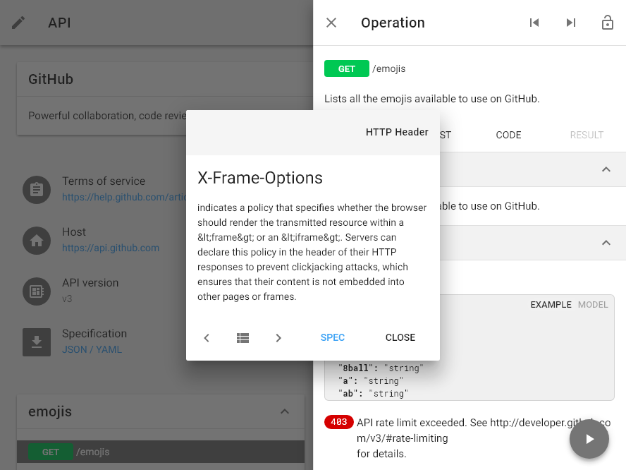
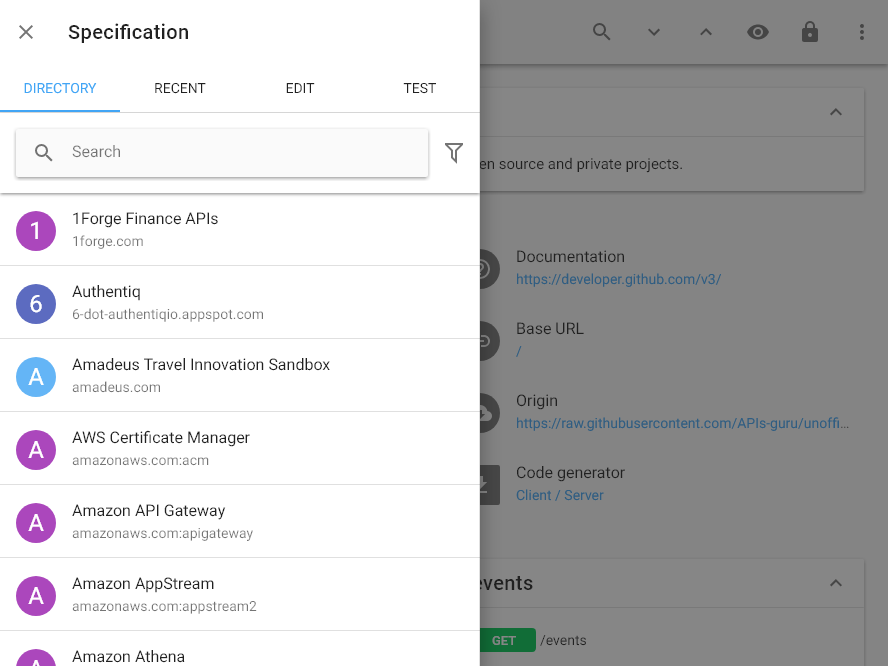
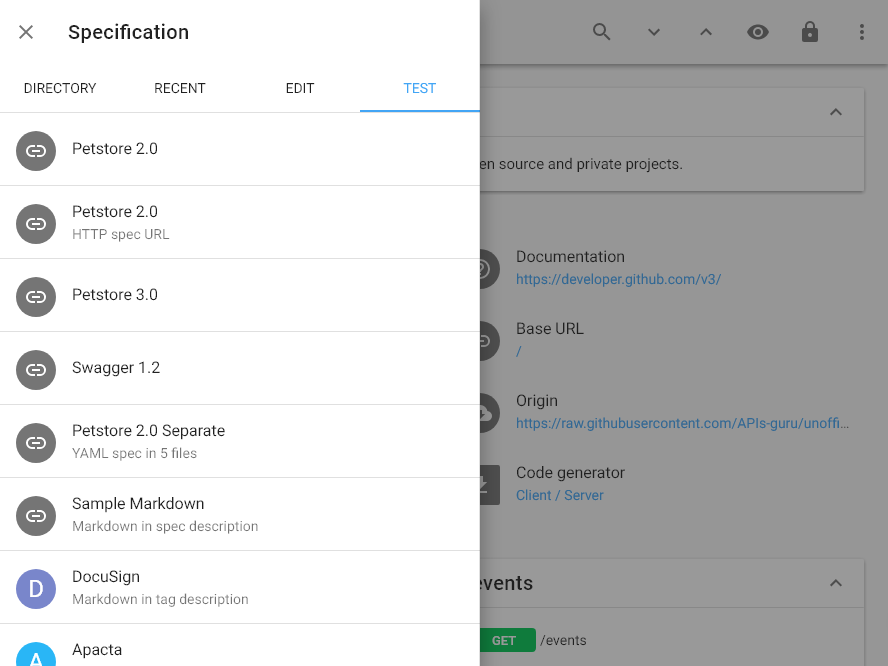

# Screenshots: md-light <small>888&times;666</small>

## loading

## landing

## download

## generator

## right

## method

## status

## header

## left

## categories

## recent

## edit

## fullscreen

## test

## methods

## statuses

## headers

## about

