# xs-light <small>360&times;640</small>

## loading

## landing

## security

## download

## generator

[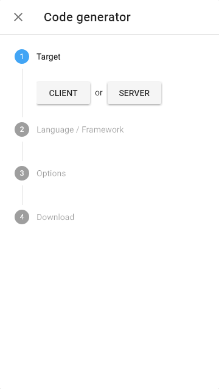](./images/light_xs_05_generator.png)

## language

## options

[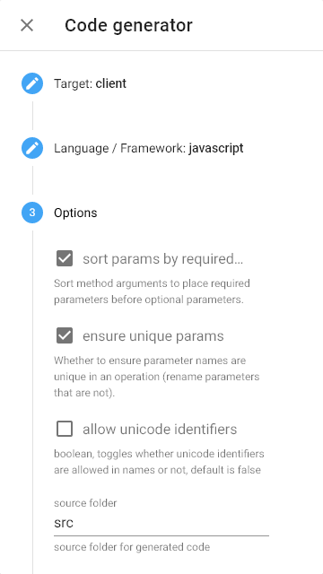](./images/light_xs_07_options.png)

## menu

[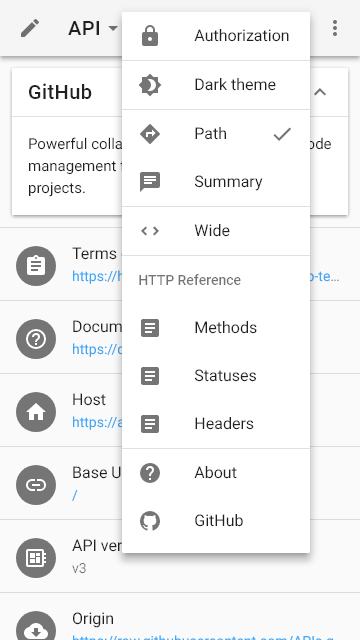](./images/light_xs_08_menu.png)

## layout

## view

[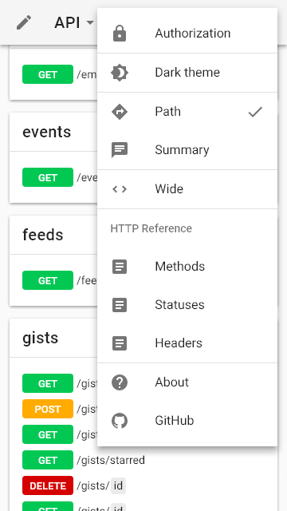](./images/light_xs_10_view.png)

## wide

[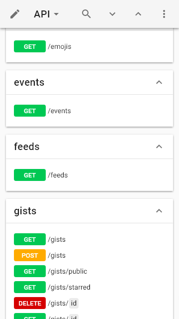](./images/light_xs_11_wide.png)

## summary+paths

[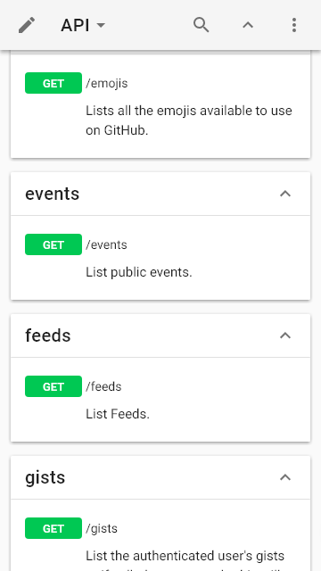](./images/light_xs_12_summary+paths.png)

## summary

## operations

[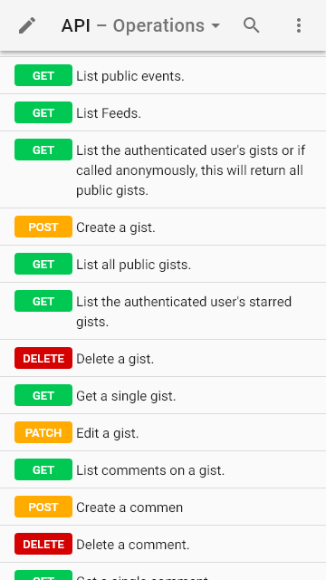](./images/light_xs_14_operations.png)

## table

[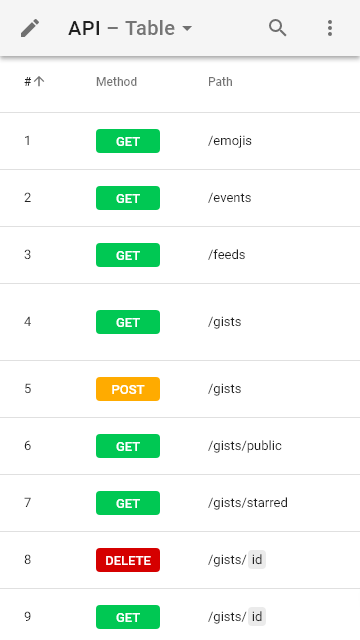](./images/light_xs_15_table.png)

## schemas

[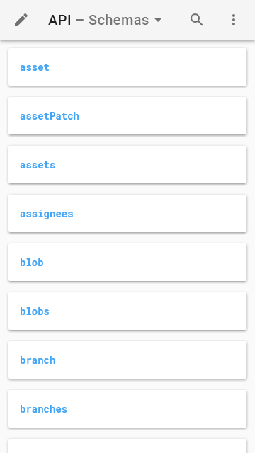](./images/light_xs_16_schemas.png)

## right

## request

## code

## method

## status

## header

[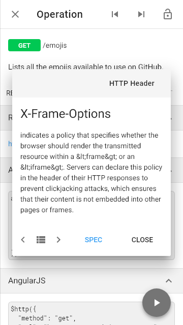](./images/light_xs_22_header.png)

## left

## categories

## recent

## edit

[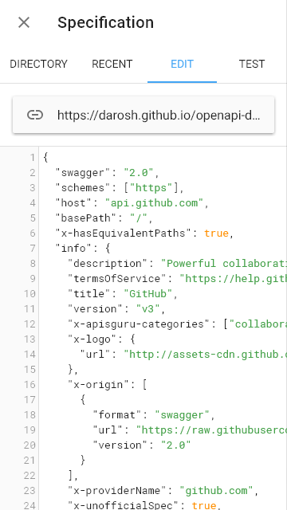](./images/light_xs_26_edit.png)

## fullscreen

## test

## methods

[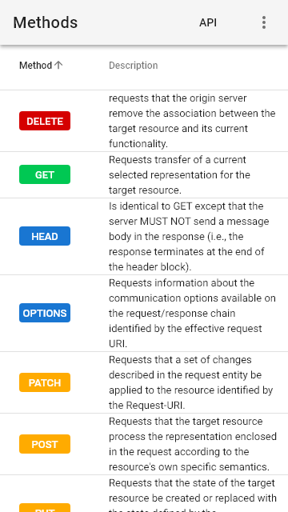](./images/light_xs_29_methods.png)

## statuses

[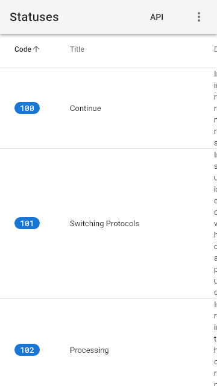](./images/light_xs_30_statuses.png)

## headers

[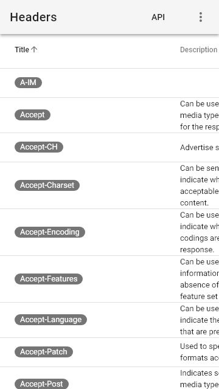](./images/light_xs_31_headers.png)

## about

[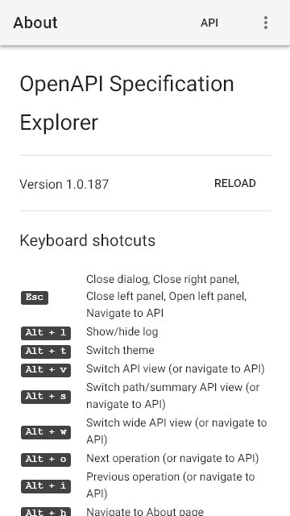](./images/light_xs_32_about.png)

## markdown

[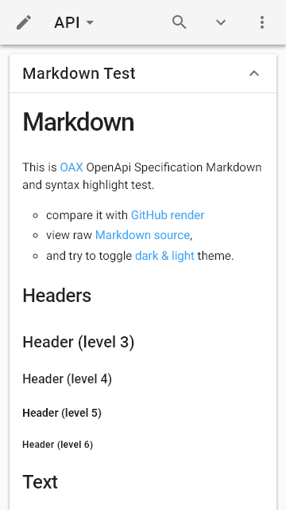](./images/light_xs_33_markdown.png)

## syntax

[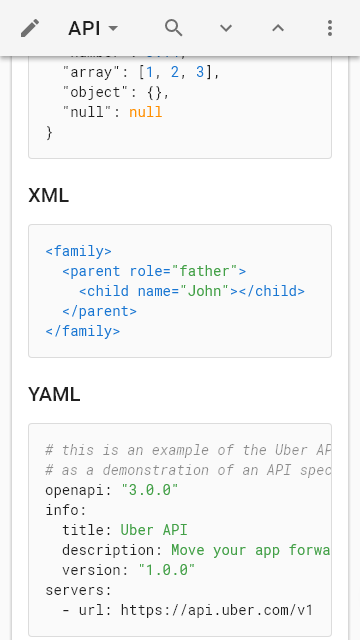](./images/light_xs_34_syntax.png)

